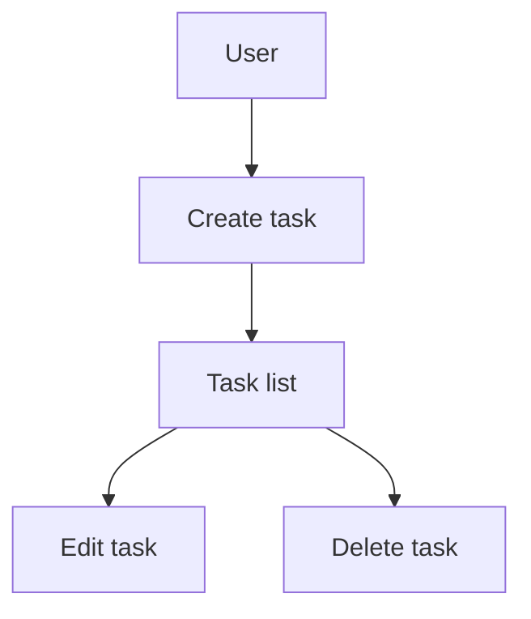

# CLAUDE.md (Project Memory)

## Overview
Defines the standard rules to follow while developing this project.

## Document Language

- Documents such as `README.md`, `CLAUDE.md` and everything under `docs/` are written in **English**.
- For each of them, keep a Japanese counterpart for the user: `README.ja.md`, `CLAUDE.ja.md`, `docs/<name>.ja.md`. The two files carry the same content; update them together so they never drift.
- Claude Code automatically loads only the English documents. The `.ja.md` files are for human readers.
- Conversation with the user is in Japanese. Code comments follow the existing style of the file.
- Working documents under `.steering/` are not auto-loaded and may be written in the language the work was done in.

## Project Structure

### Document Categories

#### 1. Permanent documents (`docs/`)

Permanent documents that define **what** the application is and **how** it is built.
They are not updated unless the basic design or policy of the application changes.

- **product-requirements.md** - Product requirements
  - Product vision and purpose
  - Target users, their problems and needs
  - Main feature list
  - Definition of success
  - Business requirements
  - User stories
  - Acceptance criteria
  - Functional requirements
  - Non-functional requirements

- **functional-design.md** - Functional design
  - Architecture per feature
  - System diagrams
  - Data model definitions (including ER diagrams)
  - Component design
  - Use case diagrams, screen transitions, wireframes
  - API design (if a backend is added later)

- **architecture.md** - Technical specification
  - Technology stack
  - Development tools and methods
  - Technical constraints and requirements
  - Performance requirements

- **repository-structure.md** - Repository structure
  - Folder and file layout
  - Role of each directory
  - File placement rules

- **development-guidelines.md** - Development guidelines
  - Coding conventions
  - Naming conventions
  - Styling conventions
  - Testing conventions
  - Git conventions

- **glossary.md** - Ubiquitous language
  - Domain terms
  - Business terms
  - UI/UX terms
  - English–Japanese correspondence table
  - Naming rules in code

#### 2. Work-unit documents (`.steering/[YYYYMMDD]-[title]/`)

Temporary steering files that define **what this piece of work does**.
They are kept for reference after the work is done; new work gets a new directory.

- **requirements.md** - Requirements for this work
  - Description of the feature to change or add
  - User stories
  - Acceptance criteria
  - Constraints

- **design.md** - Design of the change
  - Implementation approach
  - Components to change
  - Data structure changes
  - Impact analysis

- **tasklist.md** - Task list
  - Concrete implementation tasks
  - Progress of each task
  - Completion criteria

### Steering directory naming

```
.steering/[YYYYMMDD]-[title]/
```

**Examples:**
- `.steering/20250103-feat-add-tag/` - feature addition
- `.steering/20250103-fix-filter-bug/` - bug fix
- `.steering/20250103-rfct-add-tag/` - refactoring
- `.steering/20250103-rule-naming-convension/` - rule
- `.steering/20250103-docs-permanent-documents/` - documents only

## Development Process

### Initial setup

#### 1. Create folders
```bash
mkdir -p docs
mkdir -p .steering
```

#### 2. Create the permanent documents (`docs/`)

Define the design of the whole application.
After creating each document, obtain confirmation and approval before moving to the next one.

1. `docs/product-requirements.md` - Product requirements
2. `docs/functional-design.md` - Functional design
3. `docs/architecture.md` - Technical specification
4. `docs/repository-structure.md` - Repository structure
5. `docs/development-guidelines.md` - Development guidelines
6. `docs/glossary.md` - Ubiquitous language

**Important:** create one file at a time and get approval before creating the next one.

#### 3. Create the steering files for the initial implementation

Create the directory for the initial implementation and place the documents needed for it.

```bash
mkdir -p .steering/[YYYYMMDD]-initial-implementation
```

Documents to create:
1. `.steering/[YYYYMMDD]-initial-implementation/requirements.md` - Requirements
2. `.steering/[YYYYMMDD]-initial-implementation/design.md` - Design
3. `.steering/[YYYYMMDD]-initial-implementation/tasklist.md` - Tasks

#### 4. Environment setup

#### 5. Start implementing

Implement according to `.steering/[YYYYMMDD]-initial-implementation/tasklist.md`.

#### 6. Quality checks

### Adding or changing features

#### 1. Impact analysis

- Check the impact on the permanent documents (`docs/`)
- If the change affects the basic design, update `docs/`

#### 2. Create an issue, a branch and a steering directory

One steering work unit = one GitHub issue = one branch = one pull request.

1. Create a GitHub issue. Title = the steering title; label = the kind (`feat`, `fix`, `rfct`, `rule`, `docs`);
   milestone = the release version the work belongs to (e.g. `v1`); body links to the steering directory.
2. Create a branch from `main` named `<kind>/<issue number>-<title>` and do all work for this unit on it,
   including the steering documents.
3. Create the steering directory and write the issue number in the header of `requirements.md` (`Issue: #N`).

```bash
gh issue create --title "..." --label feat --milestone "v1"
git checkout -b feat/12-add-tag-feature
mkdir -p .steering/[YYYYMMDD]-[kind]-[title]
```

**Exception:** small changes that need no steering (memory notes, typo fixes in documents) may be committed
directly to `main`.

#### 3. Create the work documents

Create the work-unit documents.
After creating each document, obtain confirmation and approval before moving to the next one.

1. `.steering/[YYYYMMDD]-[title]/requirements.md` - Requirements
2. `.steering/[YYYYMMDD]-[title]/design.md` - Design
3. `.steering/[YYYYMMDD]-[title]/tasklist.md` - Task list

**Important:** create one file at a time and get approval before creating the next one.

#### 4. Update permanent documents (only when needed)

If the change affects the basic design, update the relevant documents under `docs/`.

#### 5. Start implementing

Implement according to `.steering/[YYYYMMDD]-[title]/tasklist.md`.

#### 6. Quality checks

#### 7. Pull request and merge

Open a pull request from the branch to `main` with `Closes #N` in the body. After the user approves, merge with a
**merge commit** (never squash, so the commit hashes recorded in `tasklist.md` stay valid). Record the PR number in
`tasklist.md`.

## Document Management Principles

### Permanent documents (`docs/`)
- Describe the basic design of the application
- Rarely updated
- Updated only on major design changes
- Act as the "north star" of the whole project

### Work-unit documents (`.steering/`)
- Specific to one piece of work or change
- A new directory for each piece of work
- Kept as history after the work is done
- Record the intent and the reasoning behind the change

## Diagram Rules

### Where to put them
Design diagrams are written directly inside the related permanent document.
Do not create a separate diagrams folder; keep the overhead minimal.

**Placement examples:**
- ER diagrams, data model diagrams → in `functional-design.md`
- Use case diagrams → in `functional-design.md` or `product-requirements.md`
- Screen transitions, wireframes → in `functional-design.md`
- System diagrams → in `functional-design.md` or `architecture.md`

### Format
1. **Mermaid (recommended)**
   - Embeds directly in Markdown
   - Easy to version-control
   - Editable without tools



2. **ASCII art**
   - For simple diagrams
   - Editable in a text editor

```
┌─────────────┐
│   Header    │
└─────────────┘
       │
       ↓
┌─────────────┐
│  Task List  │
└─────────────┘
```

3. **Image files (only when necessary)**
   - Complex wireframes or mockups
   - Place under `docs/images/`
   - PNG or SVG recommended

### Updating diagrams
- When the design changes, update the corresponding diagrams at the same time
- Prevent drift between diagrams and code

## Notes

- Create and update documents step by step, getting approval at each step
- Name `.steering/` directories so the date and the title identify the work clearly
- Do not mix permanent documents with work-unit documents
- Always run lint and type checks after changing code
- Use the shared design system (Tailwind CSS) for a consistent look
- Code with security in mind (XSS protection, input validation, etc.)
- Keep diagrams to the minimum needed to keep maintenance cost low
