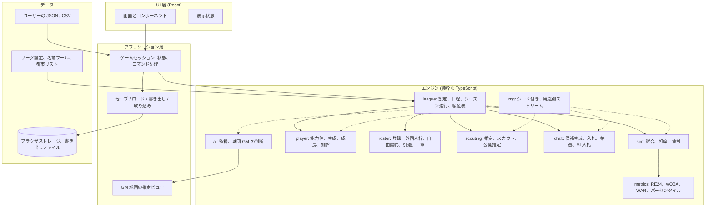
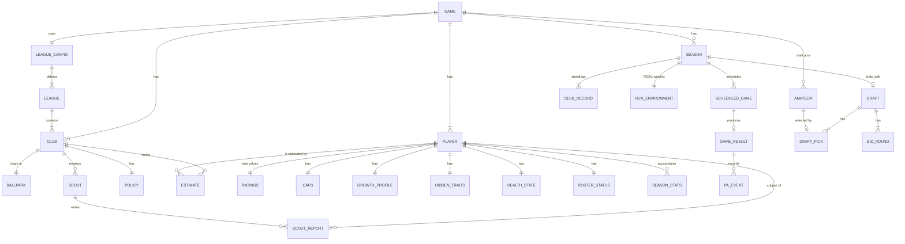
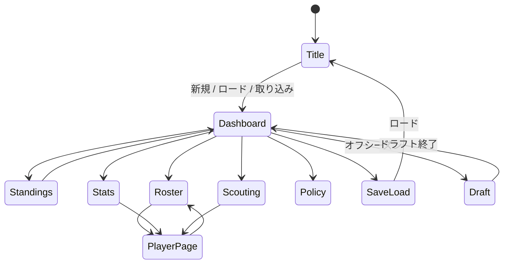

# 機能設計（Functional Design）

| | |
|---|---|
| 文書 | `docs/functional-design.ja.md`（英文版: `docs/functional-design.md`） |
| 状態 | ドラフト v0.1、2026-09-17、承認待ち |
| 範囲 | `product-requirements.md` の各機能が**どう動くか**: システム構成、データモデル、機能別の仕組み、部品、画面。技術選定は `architecture.md`、ファイル配置は `repository-structure.md` に書く |
| 基盤 | エンジン検証プロトタイプ（`prototype/`）。較正済みの仕組みは、明記しない限りそのまま引き継ぐ |

機能番号（F1〜F11）と要件 ID（FR-x.y）は `product-requirements.md` を指す。

## 1. システム全体

アプリケーションはシングルページの Web アプリで、**エンジン**（純粋な TypeScript、UI もブラウザ API も持たない）と
**UI**（React）を厳密に分ける。中間の**アプリケーション層**がゲーム状態を所有し、ユーザーの意図をエンジン呼び出しに
変え、永続化を担う。



全体を貫く規則は3つある。

1. **エンジンは意思決定者の代わりに真値を読まない。** すべての意思決定関数（打順、ブルペン、登録、ドラフト入札、
   将来のトレード）は、その球団の*推定*を返す `RatingsView` を受け取る。真値を読むのはシミュレーション自身（`sim/`）だけ。
2. **すべての乱数は注入された `Rng` から来る。** マスターシードから用途とキーで派生する（4.11 節）。
3. **時間は日次ティックだけで進む**（第3節）。他のすべての操作は照会か、次のティックで効くコマンドである。

## 2. 中核概念

| 概念 | 意味 |
|---|---|
| ゲーム（セーブ） | 1回のプレイ: リーグ、球団と選手、GM の球団、暦、これまでの全シーズン |
| シーズン | 暦の1年: プレシーズン → 公式戦（日次ティック）→ ポストシーズン → オフシーズン（ドラフト、後に契約） |
| 日 | 時間の単位。1日に0試合以上 |
| 球団 | チーム: アイデンティティ（架空名、実在都市、架空球場）、ロスター、成績、全選手の推定 |
| 選手 | 真の能力値、上限値、成長プロファイル、隠し特性、健康状態、ロスター区分、通算成績を持つ人物 |
| アマチュア | まだどの球団にも属さないドラフト対象。区分（高校／大学／社会人／独立リーグ）を持つ |
| 推定 | ある球団がある選手の能力について持つ信念: 能力ごとの平均と不確実性 |
| スカウト | 球団の職員。腕と持続的なバイアスを持ち、推定を更新する観測を生む |
| 方針 | GM が AI 監督とロスター AI に与える常設の指示 |

## 3. 日次ティック

`advanceOneDay(game)` はシーズン中の唯一の状態変更の入口である。処理の順序:

```
1. 回復       投手と野手の疲労が日ごとの量だけ回復する
2. 治癒       故障者の残り日数を減らし、治った選手は二軍リストに戻る
3. ロスター AI  AI 球団（および GM 球団の自動規則）が今日可能な登録・抹消を行う
              （10日ルール、外国人枠、投げ抹消からの復帰）
4. 試合       日程の各試合について: 推定ビューから打順を組む → シミュレート → 結果・イベント・疲労を反映。
              各試合は自分専用に派生した Rng を使う
5. 故障       今日出場した選手の故障判定（球数閾値、故障歴、球速）
6. 二軍       N 日ごとに二軍選手の成績を能力値から生成する（F5）
7. 推定       新しい成績から公開推定を更新する。自球団の判明カウンタを進める
8. 日を進める  公式戦最終日を過ぎたらポストシーズンへ。ポストシーズンが終わればオフシーズンへ
```

プレシーズン（年1回、1日目の前）: 全選手に加齢と成長を適用、前シーズンの成績からポテンシャルを更新、リーグ平均の
結果分布を実出場層に再アンカー（F3）、引退判定、日程生成、AI 球団の支配下を65名にリセット。

オフシーズン（ポストシーズン後）: ドラフト（F9）、引退の発表、契約満了（v1ではスタブ。全員が再契約）。

## 4. データモデル

### 4.1 ER 図



### 4.2 エンティティ

挙動に関わるフィールドだけを挙げる。型は TypeScript による例示。

**GAME**（セーブのルート）

| フィールド | 注記 |
|---|---|
| version | 移行のためのセーブ形式バージョン |
| masterSeed | すべての乱数派生の根 |
| config | `LeagueConfig` |
| gmClubId | プレイヤーの球団 |
| calendar | `{ year, day, phase: 'PRESEASON' \| 'SEASON' \| 'POSTSEASON' \| 'OFFSEASON' }` |
| clubs, players, amateurs | ID をキーとする Map |
| seasons | 年ごとのシーズン状態。過去シーズンは集計のみ保持 |
| rngState | 長寿命ストリームの `Rng` 状態の書き出し（4.11 参照） |

**LEAGUE_CONFIG / LEAGUE** — プロトタイプどおり: `teams`、`leagues[{id, name, dh}]`、`gamesVsSameLeague`、
`gamesVsOtherLeague`。加えて `rosterLimits { controlledMax: 70, controlledInitial: 65, active: 31, dugout: 26,
foreignActive: 5, foreignMaxPitchers, foreignMaxPositionPlayers }` と `postseason { climaxSeries: true, japanSeries: true,
finalStage: { games: 6, advantage: 1, winsToClinch: 4 }, finalStageExtended: { games: 7, advantage: 2, winsToClinch: 5 },
extendedIfGamesBehind: 10, extendedIfOpponentWinPctBelow: 0.500 }`。

**CLUB**

| フィールド | 注記 |
|---|---|
| id, name, shortName, leagueId | 名前 = 町名＋カタカナのニックネーム |
| city, ballpark { name, homeRunFactor } | 実在都市、架空球場 |
| strengthOffset | 生成時の球団間戦力差 |
| scoutIds | v1では球団ごとに少人数の固定スタッフ |
| policy | `POLICY` |
| estimates | `Map<playerId, ESTIMATE>`（私的オフセットは疎に保持。4.7 参照） |
| isAi | GM の球団以外はすべて true |

**PLAYER**

| フィールド | 注記 |
|---|---|
| id, name, clubId（アマチュアや引退後は null）, birthYear, age | |
| throws, bats | `Handedness`、`BatSide` |
| primaryPosition, pitcherRole | `Position`、`'SP' \| 'RP' \| 'CL'` |
| foreignStatus | `'DOMESTIC' \| 'FOREIGN' \| 'FOREIGN_EXEMPT'`（FR-4.6） |
| ratings | `RATINGS`（真値。表示しない） |
| caps | `CAPS` |
| growth | `GROWTH_PROFILE` |
| hidden | `HIDDEN_TRAITS` |
| health | `HEALTH_STATE` |
| roster | `ROSTER_STATUS` |
| career | 年とレベル（一軍／二軍）別の `SEASON_STATS[]` |
| revealedToOwner | `{ paSeen, bfSeen, joinedDay, revealed: boolean }`（F8） |

**RATINGS** — プロトタイプの `Ratings` をそのまま使う: `batting { meetVsR, meetVsL, powerVsR, powerVsL, contact, eye,
clutch }`、`running { speed, stealing, baserunning }`、`throwing { armStrength, armAccuracy }`、`reaction { forward,
backward, left, right }`、`fielding: Record<Position, number>`、`durability`、`pitching? { hits, homeRuns, strikeouts,
walks, stamina, recovery, clutch, arsenal: Pitch[], speed, breakAmount, control }`。捕手用に追加: `catching {
popTime, blocking }`（ポップタイムは**総時間**で持つ。1点 = 0.005秒。捕手適性または出場実績のある選手にのみ表示）。

**CAPS** — フィールドごとではなく*ツール*ごとに1つの上限値（FR-4.3）。

```ts
type BatterCapTool = 'meet' | 'power' | 'speed' | 'arm' | 'fielding' | 'contact' | 'eye' | 'clutch' | 'durability';
interface Caps {
  batter: Record<BatterCapTool, number>;         // 1〜99
  arsenal?: Record<pitchIndex, { speed: number; breakAmount: number; control: number }>;
  pitcherOther?: { stamina: number; recovery: number; clutch: number; durability: number };
}
```

1つのツールに属する複数フィールド（meetVsR/meetVsL、反応の4方向、ポジション別守備）は、選手に保存した**固定シェイプ**
（`shapes { platoonSplit, positionOffsets, reactionProfile }`）を通してツールの現在値から導出する。共有の上限に向かう
成長で個体差が消えないようにするためである。

**GROWTH_PROFILE**

| フィールド | 注記 |
|---|---|
| growthType | 7種のいずれか: `STANDARD, EARLY, LATE, SUSTAINED, EARLY_SUSTAINED, SPIKE_FALL, LATE_BLOOM` |
| potential | 隠し。0〜1。成長係数 k に写像する（k ≤ 約0.5） |
| declineResistance | 隠し。固定 |
| professionalism | `{ base, current }` — current は base に向かって戻る |

**HIDDEN_TRAITS** — `battedBall { meanLaunchAngle, pullTendency, groundFlyTendency }`、`contractPreferences`
（重みベクトル。v1では不活性）、`retirementTiming`（「引き際」）。

**HEALTH_STATE**

| フィールド | 注記 |
|---|---|
| currentInjury | `{ daysRemaining, startedDay } \| null` |
| history | 固定長の年バケット: 今季・昨季・2季前の離脱日数 |

**ROSTER_STATUS**

| フィールド | 注記 |
|---|---|
| level | `'ACTIVE' \| 'FARM' \| 'INJURED'` — いずれも支配下 |
| deactivatedOnDay | `deactivatedOnDay + 10`（当日含む）から再登録可能 |
| pitchAndDeactivate | 先発直後に AI が抹消したときに立つフラグ |
| registeredDays | 累積の一軍登録日数（145日のシーズン定義。後のフェーズで使う） |

**ESTIMATE**（ある球団がある選手について持つ信念）

```ts
interface Estimate {
  mean: Partial<RatingsFlat>;    // 能力フィールドまたはツールごと
  sigma: Partial<RatingsFlat>;
  source: 'PUBLIC' | 'PRIVATE' | 'REVEALED';
}
```

保存は2階建て（F8）。成績から計算し全球団で共有する選手ごとの**公開推定**と、球団がその選手を視察したときだけ保存する
（球団, 選手）ごとの**私的オフセット**。`REVEALED` は所有球団が真値を見ている状態。

**SCOUT** — `{ id, clubId, skill, bias: Partial<RatingsFlat> }`。**SCOUT_REPORT** — `{ scoutId, playerId, day,
observations: Partial<RatingsFlat> }`（能力ごとのノイズとバイアスを含む観測）。

**POLICY** — `{ pitchLimit: 'LOW' | 'NORMAL' | 'HIGH', aceHandling: 'PROTECT' | 'NORMAL' | 'RIDE', running:
'CAUTIOUS' | 'NORMAL' | 'AGGRESSIVE' }` に、GM が設定できる明示的な打順・ローテーションの上書きを加える。

**SEASON** — プロトタイプの `SeasonState` を拡張: `year`、`schedule`、`records`、一軍の選手別 `battingStats` /
`pitchingStats`、`farmStats`、投手と野手の `fatigue`、`runEnvironment`、`postseason`、`draft`。

**RUN_ENVIRONMENT** — RE24 表（24状態）、線形ウェイト、wOBA ウェイトとスケール、リーグ wOBA、1打席あたり得点、
今シーズン有効なリーグ平均の結果分布（アンカー）。

**SCHEDULED_GAME / GAME_RESULT / PA_EVENT** — プロトタイプどおり（`id, day, homeTeamId, awayTeamId, interleague`。
得点、イニング、引き分け、選手別成績。前後の状態を持つ打席イベント）。

**AMATEUR** — 球団のない `PLAYER` に `category: 'HIGH_SCHOOL' | 'UNIVERSITY' | 'INDUSTRIAL' | 'INDEPENDENT'`、
`eligibleYear`、`publicProfile`（全球団共有のアマチュア公開推定。先送り事項を参照）を加えたもの。

**DRAFT / BID_ROUND / DRAFT_PICK** — `draft { year, priorityLeagueId, baseOrder: clubId[], rounds }`、`bidRound {
index, bids: Map<clubId, amateurId>, lotteries: { amateurId, clubIds, winner }[] }`、`pick { round, order, clubId,
amateurId }`。

### 4.3 何をどこまで保持するか

| データ | 保持 | 理由 |
|---|---|---|
| 打席イベント、GM 球団、今シーズン | 全部 | プレイヤーに見せる試合ログ、将来の WPA |
| 打席イベント、他球団 | 日ごとに RE24 の度数と選手成績に集計して破棄 | 1シーズン64,000件を20シーズン保持するには大きすぎる |
| 選手別シーズン成績 | 全シーズン | 通算ページ、公開推定 |
| 推定 | 公開推定は現在のみ。私的オフセットは疎 | 成績から再計算できる。オフセットは視察した選手のみ |
| 試合結果（ボックススコア） | 今シーズンは全部。過去シーズンは順位表のみ | セーブサイズ |

## 5. 機能別アーキテクチャ

### 5.1 F1 リーグ生成

`generateGame(masterSeed, config, options)`:

1. **球団**: 設定にある12の実在本拠地都市を割り当てる。都市のリストから町名を、実在 NPB のニックネームをすべて除外した
   プールからカタカナのニックネームを引く。球場 = 地名＋ドーム／スタジアム／球場のいずれか。
2. **ロスター**: 球団ごとに階層（主力、レギュラー、控え、二軍）とポジション構成に従い65名を生成する。プロトタイプの
   `generate.ts` の仕組みを使い、球団ごとの戦力オフセットをかける。外国人選手は球団あたり計4〜7名となるよう配置し、
   AI は枠まで登録する（FR-4.6）。
3. **上限値、成長、隠し特性**: 選手ごとに引く。上限値 ≥ 現在値。成長型は不均等な頻度（EARLY_SUSTAINED と LATE_BLOOM は
   希少）。クラッチは `70 − Gamma(4, 5)`。
4. **推定**: 全球団が全選手の公開推定を受け取る。GM 球団は自球団の初期ロスターについて `REVEALED` を受け取る
   （決定: 初期選手は真値表示）。
5. **スカウト**: 各球団に少人数の固定スタッフを与え、腕とバイアスを一度だけ引く。

乱数: 選手は `forPurpose(ROSTER)`、球団ごとに `forPurpose(ROSTER, clubIndex)`、スカウトは `forPurpose(SCOUT, clubIndex)`。

### 5.2 F2 シーズンと暦

プロトタイプから引き継ぐ: `generateSchedule(seed, config)` が設定から総当たりのカードを組み（NPB 既定 25×5 + 3×6 = 143）、
月曜の休養日を挟んで日ごとにまとめる。実装で新たに加えるもの:

- 暦の**フェーズ**（`PRESEASON → SEASON → POSTSEASON → OFFSEASON`）。
- **ポストシーズン**（FR-1.3）: 各リーグでクライマックスシリーズのファーストステージ（2位 vs 3位、3戦2勝）と
  ファイナルステージ（1位 vs ファーストステージ勝者）、続いて日本シリーズ（7戦4勝）。ファイナルステージには2つの
  形式がある（2026年からの NPB 規則）。
  - **通常**: 6試合制。1位球団に1勝のアドバンテージ。先に4勝したチームが勝者。
  - **拡大**: 7試合制。1位球団に2勝のアドバンテージ。先に5勝したチームが勝者。**以下のいずれか**を満たす場合に
    適用する。公式戦での1位球団とファーストステージ勝者のゲーム差が10以上。**または**、ファーストステージ勝者の
    公式戦勝率が5割未満。

  どちらの形式も設定の定数で持つ（`postseason.finalStage` と `postseason.finalStageExtended`、および
  `postseason.extendedIfGamesBehind` と `postseason.extendedIfOpponentWinPctBelow`）。ポストシーズンの試合も同じ
  `simulateGame` を `GameRules { dh: true, tiesAllowed: false }` で走らせ、シーズン成績には数えない。
- 第3節の順序による**プレシーズン処理**。

### 5.3 F3 試合シミュレーション

プロトタイプの `sim/` を仕組みそのまま引き継ぐ。

- **打席**（`oddsRatio.ts`、`profile.ts`）: 能力値から `SLOPE` で打者の率、同様に投手の率を作り、リーグ平均アンカーと
  Odds Ratio 法で8結果に合成し、正規化はちょうど1回。
- **クラッチ**（`clutchFactor`）: 二塁または三塁に走者がいるとき、打者のミートと投手の `hits` に
  `1 + 0.09 × (clutch − 50) / 10` を乗じる。
- 試合内の**疲労**: 蓄積疲労で球数上限が縮み能力が下がる。ブルペン選択は疲労にペナルティを与える。
- **走者、盗塁、失策、自責点**はプロトタイプどおり。
- **イベント**: 打席ごとに1件の `PlateAppearanceEvent` を metrics の集計器に渡す。

実装フェーズでの変更（プロトタイプの既知の問題から）:

| 変更 | 仕組み |
|---|---|
| 再アンカー | 毎プレシーズン、`LEAGUE_AVERAGE` を前シーズンの実出場層の加重平均能力が含意する結果分布に差し替える。母集団が50から動いても得点環境が漂流しない |
| 球数上限の分散 | 先発の上限を幅の広い右裾の分布から引き、イニング境界で延長する（完投 6〜8回／球団シーズン、最多球数 137〜143） |
| 盗塁企図 | 2アウトでの企図と三盗を許す。チームの走塁方針が企図確率をスケールする |
| DH 解除 | AI 監督が DH を守備に回す（代打などの局面）。以後は投手の枠が打席に立つ。試合中に `Lineup.dh` が null になる |
| 野手の疲労 | 連続出場で能力がわずかに下がる。捕手はより大きく（連続8日目で OPS+ 約 −10） |

### 5.4 F4 AI 監督と GM の方針

すべての意思決定関数は `view: RatingsView`（`(playerId) => EstimatedRatings`）と `policy: Policy` を受け取る。

| 判断 | 入力 | 規則 |
|---|---|---|
| 打順 | view、相手の予告先発、疲労、DH 規則 | 推定した適性＋打力で守備位置を貪欲に埋める。予告先発の利き腕に対して `meetVsL/meetVsR` の推定でプラトーン起用。疲れた選手と捕手をローテーションで休ませる |
| ローテーション | view、前回先発からの日数、健康 | 中6日の6人ローテーション。投げ抹消の候補は10日後に戻る |
| ブルペン | view、疲労、レバレッジ、方針 | プロトタイプどおりの守護神／セットアッパー3人／中継ぎの役割。直近 N 日の登板回数に**ソフトゲート**（3連投は稀、4連投は皆無） |
| 投手交代 | イニング境界 × 球数 × 方針 | 6回終了後の95〜100球を中心に。方針が閾値をずらす。好投時は115〜130球まで完投を許す |
| DH 解除 | 試合状況 | 稀。自動 |

GM の方針画面は3つのダイヤルと任意の上書き（固定打順、ローテーション順）を設定する。GM 球団の判断は GM 球団の
ビューを、AI 球団は各自のビューを使う。

### 5.5 F5 ロスター管理

**規則エンジン**（`roster/rules.ts`）。定数はすべて `config.rosterLimits` から。

- 支配下 ≤ 70、初期65。一軍登録 ≤ 31。ベンチ26は試合日に AI 監督が登録選手から選ぶ。
- **登録**: 一軍登録 < 上限、故障中でない、かつ `today ≥ deactivatedOnDay + 10`（当日含む）なら可。
- **外国人枠**（FR-3.7）: 一軍登録の外国人（区分 `FOREIGN`）≤ `foreignActive`。うち投手 ≤ `foreignMaxPitchers`、
  野手 ≤ `foreignMaxPositionPlayers`。`FOREIGN_EXEMPT` は数えない。
- **抹消**: いつでも可。`deactivatedOnDay` を記録。故障者は自動で抹消。
- **投げ抹消**: 先発後、推定スタミナまたは耐久が閾値未満なら AI が抹消し、10日後に再登録する。これが中10日以上の
  登板間隔 22〜23% を生む。
- **自由契約**（FR-3.4）: 支配下 → 自由。選手はフリープールに入る（v1では契約なし。シーズン末に引退するが、
  ロスターに余裕のある AI 球団が推定価値で拾うことはできる）。
- **引退**（FR-3.5）: 毎オフシーズンとシーズン中の節目で評価する。スコア = f(年齢, 衰えの速さ, 出場機会の減少,
  今季の大きな故障, 契約満了スタブ) を隠しの `retirementTiming` と比較し、閾値を超えた選手は即時引退、または
  今季限りを表明する。

**二軍層**（`roster/farm.ts`、FR-3.6）: 7日ごとに、各二軍選手が二軍水準のアンカーに対する真値から成績を生成する。
ノイズは、その指標の一軍成績との相関が目標（K% 0.77、BB% 0.72、打率 0.42。投手 K 0.59、BB 0.47、防御率 0.18）に
合うようスケールする。二軍成績はポテンシャル更新と公開推定に入るが、**精度の上限**を持つ（二軍1シーズン ≒ 一軍約4か月）。

### 5.6 F6 成長と加齢

毎プレシーズンに1回、ツールごとに適用する（`player/development.ts`）。

```
target(age)  = cap[tool] × ageProfile(age, growthType, toolCategory)          // 0..1 のプロファイル
growth       = k(potential) × max(0, target − current)                        // 片側
decline      = declineTerm(age, declineResistance, professionalism.current)   // ≥ 0、ポテンシャル非依存
current'     = clamp(current + growth − decline, 1, cap[tool])
```

- `ageProfile` は能力カテゴリごとの基礎曲線（走力・球速が最早、パワーと守備が中間、四球率が最遅。NPB のピーク年齢の
  順序に従う）と、成長型による前後のずれと伸縮を合成する。
- `k(potential)` は単調で `k ≤ 0.5`。
- 衰え項は公開の加齢カーブより緩やか（ピーク約27歳、以後年 −8 OPS ポイント程度、30歳以降 年 −0.5 WAR 程度）。
  生存者バイアスがシミュレーション内部で発生するからである。
- クラッチは `decline = 0`。
- 導出フィールド（プラトーン差、反応の方向、ポジション別守備）はツール値と選手の固定シェイプから再計算する。

**ポテンシャル更新**（毎プレシーズン、前シーズンの一軍と二軍の成績から）:

```
residual[m]  = observed[m] − expected[m | ratings, level, opponents]     // 指標 m ごと
potential'   = potential + Σ_m w[m] × residual_z[m] × attitudeGain(professionalism)
             − playingTimePenalty(打席または対戦打者が閾値未満。二軍を含む)
```

重み `w[m]` は指標で異なる（三振率・四球率は高く、打率は低く、投手の防御率はほぼゼロ）。プロ意識は上げ幅を増やし
下げ幅を抑える（効果は上下対称）。上限値は動かない。

**プロ意識の変動**: `current` は毎年 `base` に向かって戻り、イベント（年齢、契約スタブ。コーチとベテランは後で）で
揺れる。

### 5.7 F7 疲労と故障

**疲労**（`sim/fatigue.ts`）: 投手の疲労はプロトタイプから引き継ぐ（登板1回 `22 + 球数 × 0.7`、毎日 `10 + 回復 × 0.2`）。
野手の疲労: 先発出場1試合 +1、休養日 −1.5、捕手は1試合 +1.5。能力への効きは小さく線形。

**故障**（`player/injury.ts`）。出場した選手について毎日判定する（乱数 `forPurpose(INJURY, year, day)`）。

```
p(今日の故障) = base(level, role) × historyMultiplier(health.history) × velocityMultiplier(fastballOf(arsenal).speed)
               × pitchThreshold(今日の球数 > 115..120) × durabilityMultiplier(durability, 弱く)
離脱日数      ~ 対数正規。平均 ≈ 50、中央値 11〜20（NPB: 発生率 ≈ MLB / 3.7、期間 ≈ 2倍）
```

- `historyMultiplier` は直近2シーズンにまとまった離脱があれば約2倍（部位を持たないので同一部位の12〜14倍は使わない）。
  記憶は年バケットを通じて約2年で減衰。
- 年齢は独立した因子に**しない**（故障歴に吸収される）。
- バードゥッチ効果はなし。球数の効果は線形ではなく閾値型。
- 故障者は自動で抹消され、治癒すると `FARM` に戻る。

### 5.8 F8 スカウトと推定

（球団, 選手）ごとに**3層**: 真値 → 推定 → 表示。

**推定の更新**は能力ごとのカルマンフィルタ。

```
予測:  σ² ← σ² + processNoise(年齢。成長型は不明なので汎用)                 // 真値が動き、不確実性が増える
更新:  K = σ² / (σ² + σ_obs²);  mean ← mean + K (obs − mean);  σ² ← (1 − K) σ²
σ_obs = visibility[rating] × scoutNoise(scout.skill)
obs   = true + scout.bias[rating] + N(0, σ_obs)
```

- `visibility`: 走力と球速は小さく、ミート・選球眼・クラッチは大きい。守備は中間だが収束が遅い（UZR 的な年度間相関
  0.26〜0.36）。
- **スカウトのバイアス**はスカウトごとに一度引き、縮まない。クロスチェックでバイアスが平均化される。
- **公開推定**（`scouting/public.ts`）: シーズン成績のある全選手について成績から計算し、全球団で共有する。σ は打席数で
  縮む（レギュラーは1シーズンで σ ≈ 4.8）。
- **私的オフセット**: `σ_off = 0.5 × σ_pub`。視察した選手のみ保存。
- **判明**（FR-5.4）: 所有球団の推定は `paSeen ≥ 50`（投手は `bfSeen ≥ 100`）または加入から60日で `REVEALED` になる。
  基礎能力のみ。上限値、ポテンシャル、成長型、隠し特性は決して判明しない。
- **アマチュアの公開プロファイル**: 区分と見出し的事実（球速、大会成績）からの粗い共有推定。正確な構成は先送り事項。

**表示**（`app/views.ts`）: 獲得前は平均を5刻みに丸め 20〜80 にクランプして Present、上限の推定を同様に Future。
判明後は整数値。他球団の選手は公開推定。σ は視覚的な濃淡にのみ写す。

### 5.9 F9 ドラフト

`draft/` はオフシーズンに走る。

1. **候補生成**: 区分ごとに年齢、Present（1〜99 で高校 ≈ 27、大学 ≈ 31、社会人 ≈ 35、独立 ≈ 30）、上限値の分布
   （Future 平均 48〜50）、成長型を持つアマチュアを生成する。投手の分散は広い。
2. **基準順**（FR-1.4）: 各球団のリーグ内順位を順位比率に正規化し、全球団を比率の降順に並べ、同順位は優先リーグ
   （奇数年セ、偶数年パ）で分ける。2リーグ同数なら `[優先6位, 非優先6位, 優先5位, …]` を再現する。
3. **1巡目**（FR-6.1）: 各球団が1名を提出。2球団以上が重なったグループは抽選（乱数 `forPurpose(DRAFT, year, roundIndex)`）。
   外れた球団は再入札し、全球団が確定するまで繰り返す。
4. **2巡目以降**: 基準順からのスネーク。偶数巡は基準順、奇数巡は逆順。1球団10名、全体120名。終了宣言した球団は
   復帰できない（FR-6.2）。
5. **AI の入札**（FR-6.4）: 各 AI 球団は各アマチュアについて他球団が入札する確率を（公開プロファイルから）推定し、
   `P(獲得) × 推定価値` を最大にする選手を選ぶ。球団ごとの積極度パラメータが競合回避の度合いを制御し、これが
   競合統計の較正レバーになる。
6. **GM**: スカウト画面から入札先を選ぶ。早期終了もできる。

### 5.10 F10 成績

プロトタイプの `metrics/` を拡張する。

- ティック中の**集計**: RE24 の度数と線形ウェイトの和をイベントからシーズンごとに累積。選手成績はシーズンとレベル
  ごとに累積。
- **得点環境**はシーズン末に計算する（シーズン中は累積値から暫定値）。
- **wOBA、wRC+、FIP、WAR** はプロトタイプの `advanced.ts` どおり。ポジション調整は NPB（DELTA）値に切り替え、
  DH −15.1 を含めて `appearances` で按分する。
- **パーセンタイル**は成績は規定到達者の母集団、能力値は一軍選手の母集団で計算する（能力値は*見る側*の推定を使う）。

### 5.11 F11 永続化と乱数

**乱数ストリーム**: 試合は `game(year, day, gameId)`（状態を持たない派生）。長寿命ストリームは
`forPurpose(INJURY, year, day)`、`forPurpose(GROWTH, year)`、`forPurpose(SCOUT, clubIndex, year)`、
`forPurpose(DRAFT, year, round)`、`forPurpose(AI, clubIndex, year, day)`。すべてのストリームは `(masterSeed, keys)` から
派生できるので、セーブにはマスターシードと、セーブ時点で使用中のストリームの状態だけが要る。

**セーブ形式**: バージョン付き JSON（`{ version, savedAt, game }`）。スロット名で IndexedDB に書き、ファイルとして
書き出せる。ロード時に古いバージョンを前方移行する。永続化するのは 4.3 節のデータのみ。

**取り込み**（FR-8.2）: `clubs[]` と `players[]` を持つ JSON 文書。能力値は 1〜99 または 20〜80 のスケールで与えられる
（一度だけ宣言）。欠けた能力値はポジションの既定値の周りで生成する。すべてのフィールドをスキーマで検証し、文字列は
テキストとしてのみ扱う。

## 6. 部品設計

### 6.1 エンジンのモジュール

```
engine/
  rng.ts                 Rng, deriveSeed, RNG_PURPOSE, RngStreams
  league/                config, schedule, season（日次ティック）, standings, postseason, calendar
  sim/                   oddsRatio, profile, game, fatigue, events, stats
  player/                ratings, arsenal, clutch, generate, development, aging, injury
  roster/                rules（上限、外国人枠、10日）, moves, farm, retirement
  scouting/              estimate（カルマン）, scouts, public, reveal, views
  draft/                 class, order, bidding, lottery, aiBid
  ai/                    manager（打順、ローテーション、ブルペン、交代）, clubGm（登録、自由契約）
  metrics/               runExpectancy, advanced, percentile, leagueLevel, clutchAnalysis
  save/                  serialize, migrate, import
```

各モジュールはプレーンなデータに対する純粋関数を公開する。メモリ上では Map を使い、セーブ時に配列へ変換する。

### 6.2 アプリケーション層

- `GameSession`: `Game` オブジェクトを保持し、コマンド（`advanceDay`、`advanceTo(dayOrEvent)`、`register`、
  `deactivate`、`release`、`setPolicy`、`assignScout`、`submitBid`、`save`、`load`）と照会（順位表、ロスタービュー、
  選手ページ）を公開する。コマンドは `roster/rules` で検証し、結果または拒否理由を返す。
- `ViewFactory`: 推定から GM 球団の `RatingsView` と表示オブジェクト（20〜80、正確な値、公開推定）を組み立てる。
- 長いシミュレーション（`advanceTo`）は Web Worker で走らせ、進捗イベントを出して UI の応答性を保つ。

### 6.3 UI コンポーネントツリー（概略）

```
App
├─ TitleScreen（新規、ロード、取り込み）
├─ Shell（ヘッダ: 日付、球団、フェーズ。ナビ）
│  ├─ Dashboard      今日の試合、翌日ボタン、ニュース
│  ├─ Standings      リーグ別、CS 争い
│  ├─ Roster         一軍／二軍／支配下タブ、登録・抹消、外国人枠の表示
│  ├─ PlayerPage     能力値（ビュー依存）、パーセンタイル、シーズンと通算成績、健康、所見
│  ├─ Stats          リーダー、球団・リーグの表、高度な指標
│  ├─ Scouting       アマチュア一覧、スカウト割り当て、報告、Present/Future グレード
│  ├─ Draft          入札の提出、抽選結果、各巡
│  ├─ Policy         球数上限、エースの扱い、走塁、上書き
│  └─ SaveLoad       スロット、書き出し、取り込み
└─ Dialogs           確認、拒否（外国人枠、10日ルール）
```

## 7. 画面

### 7.1 遷移



### 7.2 ワイヤーフレーム

**ダッシュボード（シーズン中の1日）**

```
┌──────────────────────────────────────────────────────────────────────┐
│ 水道橋ラビッツ   2027年 6月12日 (Day 78)  公式戦   [方針] [保存]      │
├──────────────────────────────┬───────────────────────────────────────┤
│ 今日の試合                    │ 順位 (セントラル)                      │
│  水道橋 4 – 2 神宮前   9回    │  1 水道橋   45-30-3  —                 │
│  先発: 佐藤 7回 98球 2失点     │  2 神宮前   43-33-2  2.5               │
│  [ボックススコア]             │  3 ...                                 │
├──────────────────────────────┼───────────────────────────────────────┤
│ ニュース                      │ 一軍登録  31/31   外国人 4/5 (投2 野2) │
│  ・鈴木 抹消 (右肩, 約3週間)   │ 登録可能になる選手: 田中 (6/15)        │
│  ・山田 二軍で .320 (直近2週)  │                                        │
├──────────────────────────────┴───────────────────────────────────────┤
│              [ 1日進める ]   [ 次のイベントまで ]   [ 日付指定 ]        │
└──────────────────────────────────────────────────────────────────────┘
```

**選手ページ（自球団の判明済み選手）**

```
┌──────────────────────────────────────────────────────────────────────┐
│ 佐藤 大樹  右投左打  27歳  遊撃  一軍   国内                          │
├───────────────────────────────┬──────────────────────────────────────┤
│ 能力 (判明)                    │ パーセンタイル (規定打席の野手)        │
│  ミート 対右 62  対左 55       │  wRC+   ████████░░ 82                 │
│  パワー 対右 48  対左 44       │  出塁率 ███████░░░ 71                 │
│  コンタクト 57  選球眼 60      │  盗塁   █████████░ 93                 │
│  走力 71  肩 55  遊撃守備 66   │  守備   ██████░░░░ 58                 │
│  クラッチ 53  耐久 49          │                                       │
│  上限 (推定): 55/65 形式は     │ 成長: コーチ所見なし (v1)       │
│  獲得前のみ表示                │ 故障歴: 今季 0日 / 昨季 21日 / 2季前 0 │
├───────────────────────────────┴──────────────────────────────────────┤
│ 成績  年  球団  試 打席 打率 出塁 OPS  wOBA wRC+ WAR  | 二軍 ...      │
│ 2027 水道橋  78  330 .285 .352 .790 .341 118  2.4                     │
└──────────────────────────────────────────────────────────────────────┘
```

他球団の選手の能力値は公開推定を薄い文字で示す。アマチュアは `55/70` 形式のグレードで示す。

**スカウト**

```
┌──────────────────────────────────────────────────────────────────────┐
│ スカウト   担当: 高橋 (関東・高校)  中村 (大学)  伊藤 (社会人)           │
├──────────────────────────────────────────────────────────────────────┤
│ 名前        区分  年齢 位置  ミート  パワー  走   肩   守備  総合  視察 │
│ 大谷 ○○     高校  18  投手  —       —      —   70/75  —    55/70  2   │
│ 佐々木 ○○   大学  22  遊撃  50/60   40/50  60/60 55/55 55/60 50/60  3 │
│ ...  (数字の濃さ = 確信度。薄いほど不確か)                              │
├──────────────────────────────────────────────────────────────────────┤
│ [視察を割り当てる]  [1巡目の入札候補にする]                             │
└──────────────────────────────────────────────────────────────────────┘
```

**ドラフト（1巡目抽選）**

```
┌──────────────────────────────────────────────────────────────────────┐
│ ドラフト 2027   1巡目 入札 (第2回)   優先リーグ: セントラル             │
├──────────────────────────────────────────────────────────────────────┤
│ 選手         入札球団                         結果                     │
│ 大谷 ○○      水道橋, 神宮前, 甲子園           抽選 → 神宮前            │
│ 佐々木 ○○    横浜                             単独 → 横浜              │
│ ...                                                                  │
├──────────────────────────────────────────────────────────────────────┤
│ あなたの入札: [ 選手を選ぶ ▼ ]   [ 入札する ]   [ 選択を終了する ]      │
└──────────────────────────────────────────────────────────────────────┘
```

**ロスター**

```
┌──────────────────────────────────────────────────────────────────────┐
│ ロスター   [一軍 31/31] [二軍 34] [支配下 65/70]   外国人 4/5 (投2 野2) │
├──────────────────────────────────────────────────────────────────────┤
│ 一軍  名前     位置  年齢  区分  疲労  状態        操作                │
│       佐藤     遊撃  27   国内   ●○○   —          [抹消]              │
│       ロペス   一塁  31   外国人 ●●○   —          [抹消]              │
│ 二軍  田中     投手  24   国内   —     6/15 まで不可 [登録 (不可)]      │
│       山田     外野  22   国内   —     —          [登録]              │
└──────────────────────────────────────────────────────────────────────┘
```

## 8. インターフェース

バックエンド API はない。重要な契約は2つ。

### 8.1 エンジンの公開面（アプリケーション → エンジン）

| 関数 | 目的 |
|---|---|
| `generateGame(seed, config, options): Game` | 新規ゲーム（F1） |
| `advanceOneDay(game): DayReport` | ティック（第3節） |
| `runPreseason(game)`, `runPostseason(game)`, `runDraft(game, gmBids)` | フェーズ遷移 |
| `roster.canRegister(game, clubId, playerId): Ok \| Refusal` と `register / deactivate / release` | F5 |
| `scouting.assign(game, clubId, scoutId, playerId)`, `scouting.viewFor(game, clubId): RatingsView` | F8 |
| `draft.submitBid(game, clubId, amateurId)` | F9 |
| `metrics.runEnvironment(season)`, `metrics.playerValue(game, playerId)`, `metrics.percentiles(...)` | F10 |
| `save.serialize(game): SaveFile`, `save.deserialize(file): Game`, `save.importData(file): ImportResult` | F11 |

### 8.2 取り込みファイル（ユーザー → アプリケーション）

```json
{
  "format": "hayakaze-import",
  "version": 1,
  "ratingScale": "1-99",
  "clubs": [{ "id": "C01", "name": "…", "shortName": "…", "league": "CENTRAL", "city": "東京", "ballpark": "…" }],
  "players": [{
    "clubId": "C01", "name": "…", "age": 27, "throws": "R", "bats": "L",
    "primaryPosition": "SS", "foreignStatus": "DOMESTIC",
    "ratings": { "meetVsR": 62, "meetVsL": 55, "…": 0 },
    "pitching": null
  }]
}
```

未知のフィールドは無視し、欠けた能力値は生成し、不正な値はパスとともに報告して取り込み全体を拒否する。
