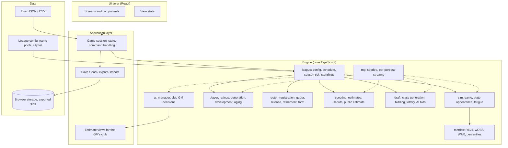
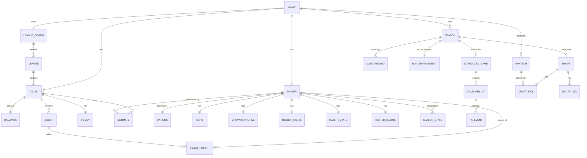
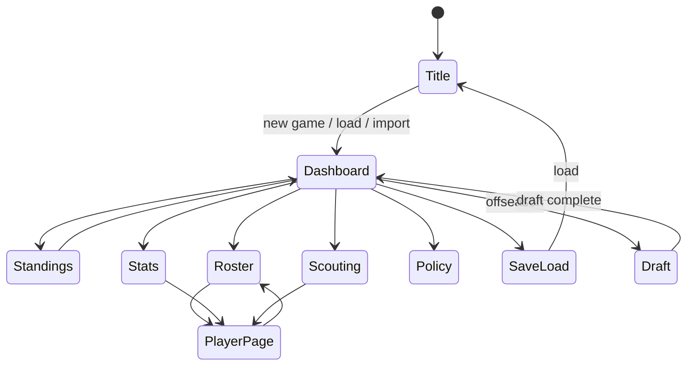

# Functional Design

| | |
|---|---|
| Document | `docs/functional-design.md` (Japanese: `docs/functional-design.ja.md`) |
| Status | Draft v0.1, 2026-09-17, awaiting approval |
| Scope | **How** each feature of `product-requirements.md` works: system structure, data model, per-feature mechanics, components, screens. Technology choices live in `architecture.md`; file layout in `repository-structure.md` |
| Basis | The engine validation prototype (`prototype/`), whose calibrated mechanics are carried over unchanged unless stated |

Feature numbers (F1–F11) and requirement IDs (FR-x.y) refer to `product-requirements.md`.

## 1. System Overview

The application is a single-page web app with a strict split between the **engine** (pure TypeScript, no UI, no
browser API) and the **UI** (React). An **application layer** in between owns the game state, turns user intents into
engine calls, and handles persistence.



Three rules hold everywhere:

1. **The engine never reads true ratings on behalf of a decision maker.** Every decision function (lineup, bullpen,
   registration, draft bid, trade later) receives a `RatingsView` that returns that club's *estimate* of a player.
   Only the simulation itself (`sim/`) reads true ratings.
2. **All randomness comes from injected `Rng` instances** derived from the master seed by purpose and key (section 4.11).
3. **Time advances only through the daily tick** (section 3). Every other operation is a query or a command that
   takes effect at the next tick.

## 2. Core Concepts

| Concept | Meaning |
|---|---|
| Game (save) | One playthrough: a league, its clubs and players, the GM's club, the calendar, all seasons so far |
| Season | One calendar year: preseason → regular season (daily ticks) → postseason → offseason (draft, contracts later) |
| Day | The unit of time. A day has zero or more games |
| Club | A team: identity (fictional name, real city, fictional ballpark), roster, records, estimates of every player |
| Player | A person with true ratings, caps, growth profile, hidden traits, health, roster status, and career statistics |
| Amateur | A draft-eligible player not yet on any club, with a category (high school / university / industrial / independent) |
| Estimate | One club's belief about one player's ratings: mean and uncertainty per rating |
| Scout | An employee of a club with skill and persistent bias; produces observations that update estimates |
| Policy | The GM's standing instructions to the AI manager and roster AI |

## 3. The Daily Tick

`advanceOneDay(game)` is the only mutating entry point during a season. Order of operations:

```
1. Recover     pitcher and position-player fatigue recover by daily amounts
2. Heal        injured players' remaining days decrement; recovered players return to the farm list
3. Roster AI   AI clubs (and the GM's club for automatic rules) perform registrations and deactivations
               permitted today (10-day rule, quota, pitch-and-deactivate returns)
4. Games       for each scheduled game: build lineups from estimate views → simulate → apply results,
               events, fatigue; each game uses its own derived Rng
5. Injuries    injury rolls for players who appeared today (pitch-count threshold, history, velocity)
6. Farm        every N days: generate farm statistics for farm players from ratings (F5)
7. Estimates   update public estimates from new statistics; own-club revelation counters advance
8. Day++       if the last regular-season day passed → postseason; if postseason done → offseason
```

Preseason (once a year, before day 1): aging and growth applied to every player, potential updates from last
season's statistics, re-anchoring of the league-average outcome distribution to the playing population (F3), retirement
decisions, schedule generation, roster reset to 65-man controlled lists for AI clubs.

Offseason (after the postseason): draft (F9), retirements announced, contract expiry (a stub in v1: all players
renew).

## 4. Data Model

### 4.1 ER diagram



### 4.2 Entities

Only fields that matter for behaviour are listed. Types are illustrative TypeScript.

**GAME** (the save root)

| Field | Notes |
|---|---|
| version | Save format version for migration |
| masterSeed | Root of all RNG derivation |
| config | `LeagueConfig` |
| gmClubId | The player's club |
| calendar | `{ year, day, phase: 'PRESEASON' \| 'SEASON' \| 'POSTSEASON' \| 'OFFSEASON' }` |
| clubs, players, amateurs | Maps by id |
| seasons | Per-year season state; older seasons keep only aggregates |
| rngState | Serialised `Rng` states for long-lived streams (see 4.11) |

**LEAGUE_CONFIG / LEAGUE** — as in the prototype: `teams`, `leagues[{id, name, dh}]`, `gamesVsSameLeague`,
`gamesVsOtherLeague`, plus `rosterLimits { controlledMax: 70, controlledInitial: 65, active: 31, dugout: 26,
foreignActive: 5, foreignMaxPitchers, foreignMaxPositionPlayers }` and `postseason { climaxSeries: true, japanSeries: true,
finalStage: { games: 6, advantage: 1, winsToClinch: 4 }, finalStageExtended: { games: 7, advantage: 2, winsToClinch: 5 },
extendedIfGamesBehind: 10, extendedIfOpponentWinPctBelow: 0.500 }`.

**CLUB**

| Field | Notes |
|---|---|
| id, name, shortName, leagueId | Name = town + katakana nickname |
| city, ballpark { name, homeRunFactor } | Real city, fictional ballpark |
| strengthOffset | Generation-time team strength difference |
| scoutIds | v1: a small fixed staff per club |
| policy | `POLICY` |
| estimates | `Map<playerId, ESTIMATE>` (private offsets are stored sparsely; see 4.7) |
| isAi | All clubs except the GM's |

**PLAYER**

| Field | Notes |
|---|---|
| id, name, clubId (nullable for amateurs after retirement), birthYear, age | |
| throws, bats | `Handedness`, `BatSide` |
| primaryPosition, pitcherRole | `Position`, `'SP' \| 'RP' \| 'CL'` |
| foreignStatus | `'DOMESTIC' \| 'FOREIGN' \| 'FOREIGN_EXEMPT'` (FR-4.6) |
| ratings | `RATINGS` (true values, never displayed) |
| caps | `CAPS` |
| growth | `GROWTH_PROFILE` |
| hidden | `HIDDEN_TRAITS` |
| health | `HEALTH_STATE` |
| roster | `ROSTER_STATUS` |
| career | `SEASON_STATS[]` by year and level (first team / farm) |
| revealedToOwner | `{ paSeen, bfSeen, joinedDay, revealed: boolean }` (F8) |

**RATINGS** — the prototype's `Ratings` unchanged: `batting { meetVsR, meetVsL, powerVsR, powerVsL, contact, eye,
clutch }`, `running { speed, stealing, baserunning }`, `throwing { armStrength, armAccuracy }`, `reaction { forward,
backward, left, right }`, `fielding: Record<Position, number>`, `durability`, `pitching? { hits, homeRuns, strikeouts,
walks, stamina, recovery, clutch, arsenal: Pitch[], speed, breakAmount, control }`. Added for catchers: `catching {
popTime, blocking }` (pop time held as **total time**, 1 point = 0.005 s; shown only for players with catcher aptitude or
appearances).

**CAPS** — one cap per *tool*, not per field (FR-4.3).

```ts
type BatterCapTool = 'meet' | 'power' | 'speed' | 'arm' | 'fielding' | 'contact' | 'eye' | 'clutch' | 'durability';
interface Caps {
  batter: Record<BatterCapTool, number>;         // 1–99
  arsenal?: Record<pitchIndex, { speed: number; breakAmount: number; control: number }>;
  pitcherOther?: { stamina: number; recovery: number; clutch: number; durability: number };
}
```

Fields under one tool (meetVsR/meetVsL, the four reaction directions, fielding by position) are derived from the tool's
current value through **fixed shapes** stored on the player (`shapes { platoonSplit, positionOffsets, reactionProfile }`)
so that individual differences are not erased by growth toward a shared cap.

**GROWTH_PROFILE**

| Field | Notes |
|---|---|
| growthType | One of seven: `STANDARD, EARLY, LATE, SUSTAINED, EARLY_SUSTAINED, SPIKE_FALL, LATE_BLOOM` |
| potential | Hidden, 0–1, maps to the growth coefficient k (k ≤ about 0.5) |
| declineResistance | Hidden, fixed |
| professionalism | `{ base, current }` — current drifts toward base |

**HIDDEN_TRAITS** — `battedBall { meanLaunchAngle, pullTendency, groundFlyTendency }`, `contractPreferences`
(weight vector, inert in v1), `retirementTiming` ("sense of timing").

**HEALTH_STATE**

| Field | Notes |
|---|---|
| currentInjury | `{ daysRemaining, startedDay } \| null` |
| history | Fixed-length year buckets: days lost this season, last season, two seasons ago |

**ROSTER_STATUS**

| Field | Notes |
|---|---|
| level | `'ACTIVE' \| 'FARM' \| 'INJURED'` — all are controlled players |
| deactivatedOnDay | Re-registration allowed from `deactivatedOnDay + 10` (day inclusive) |
| pitchAndDeactivate | Flag set by AI when a starter is deactivated after a start |
| registeredDays | Cumulative active days (for the 145-day service definition, used later) |

**ESTIMATE** (one club's belief about one player)

```ts
interface Estimate {
  mean: Partial<RatingsFlat>;    // per rating field or per tool
  sigma: Partial<RatingsFlat>;
  source: 'PUBLIC' | 'PRIVATE' | 'REVEALED';
}
```

Storage is two-tier (F8): a **public estimate** per player computed from statistics and shared by every club, plus a
**private offset** per (club, player) stored only when a club has scouted the player. `REVEALED` means the owner sees true
values.

**SCOUT** — `{ id, clubId, skill, bias: Partial<RatingsFlat> }`. **SCOUT_REPORT** — `{ scoutId, playerId, day,
observations: Partial<RatingsFlat> }` (a noisy, biased observation per rating).

**POLICY** — `{ pitchLimit: 'LOW' | 'NORMAL' | 'HIGH', aceHandling: 'PROTECT' | 'NORMAL' | 'RIDE', running:
'CAUTIOUS' | 'NORMAL' | 'AGGRESSIVE' }` plus explicit lineup/rotation overrides the GM may set.

**SEASON** — the prototype's `SeasonState` extended: `year`, `schedule`, `records`, `battingStats`/`pitchingStats` by
player for first team, `farmStats`, `fatigue` for pitchers and position players, `runEnvironment`, `postseason`, `draft`.

**RUN_ENVIRONMENT** — RE24 table (24 states), linear weights, wOBA weights and scale, league wOBA, runs per PA, the
league-average outcome distribution (anchor) in force this season.

**SCHEDULED_GAME / GAME_RESULT / PA_EVENT** — as in the prototype (`id, day, homeTeamId, awayTeamId, interleague`;
scores, innings, tie, per-player lines; plate-appearance events with state before and after).

**AMATEUR** — a `PLAYER` without a club plus `category: 'HIGH_SCHOOL' | 'UNIVERSITY' | 'INDUSTRIAL' | 'INDEPENDENT'`,
`eligibleYear`, `publicProfile` (the shared amateur public estimate; see deferred decisions).

**DRAFT / BID_ROUND / DRAFT_PICK** — `draft { year, priorityLeagueId, baseOrder: clubId[], rounds }`, `bidRound {
index, bids: Map<clubId, amateurId>, lotteries: { amateurId, clubIds, winner }[] }`, `pick { round, order, clubId,
amateurId }`.

### 4.3 What is stored where

| Data | Kept | Rationale |
|---|---|---|
| PA events, GM's club, current season | All | Player-facing game logs, WPA later |
| PA events, other clubs | Aggregated into RE24 counts and per-player lines daily, then discarded | 64,000 events per season is too large to keep for 20 seasons |
| Per-player season lines | All seasons | Career pages, public estimates |
| Estimates | Public: current only. Private offsets: sparse | Recomputed from stats; offsets only where scouted |
| Game results (box scores) | Current season fully; past seasons standings only | Save size |

## 5. Feature Architecture

### 5.1 F1 League generation

`generateGame(masterSeed, config, options)`:

1. **Clubs**: assign the twelve real home cities from the config; draw a town name from the city's list and a katakana
   nickname from a pool that excludes every real NPB nickname; ballpark = place + one of ドーム / スタジアム / 球場.
2. **Rosters**: for each club, generate 65 players by tier (stars, regulars, bench, farm) and positional profile using
   the prototype's `generate.ts` mechanics, with a per-club strength offset. Foreign players are placed so that the
   club has 4–7 foreign players in total, of which the AI registers up to the quota (FR-4.6).
3. **Caps, growth, hidden traits**: drawn per player; caps ≥ current value; growth type by unequal frequency
   (EARLY_SUSTAINED and LATE_BLOOM rare); clutch from `70 − Gamma(4, 5)`.
4. **Estimates**: every club receives the public estimate of every player. The GM's club receives `REVEALED` for its own
   initial roster (decision: initial players show true values).
5. **Scouts**: each club receives a fixed small staff with skill and bias drawn once.

RNG: `forPurpose(ROSTER)` for players, `forPurpose(ROSTER, clubIndex)` per club, `forPurpose(SCOUT, clubIndex)` for scouts.

### 5.2 F2 Season and calendar

Carried from the prototype: `generateSchedule(seed, config)` builds round-robin series from the config
(NPB default 25×5 + 3×6 = 143), grouped by day with Monday off-days. New in the implementation:

- **Phases** on the calendar (`PRESEASON → SEASON → POSTSEASON → OFFSEASON`).
- **Postseason** (FR-1.3): Climax Series first stage (2nd vs 3rd, best of 3) and final stage (1st vs the first-stage
  winner) per league, then Japan Series (best of 7). The final stage has two formats (NPB rule from 2026):
  - **Standard**: 6 games, the 1st-place club starts with a 1-win advantage, first to 4 wins.
  - **Extended**: 7 games, the 1st-place club starts with a 2-win advantage, first to 5 wins. Used when **either** the
    regular-season games-behind between the 1st-place club and the first-stage winner is 10 or more, **or** the
    first-stage winner's regular-season winning percentage is below .500.

  Both formats are config constants (`postseason.finalStage` and `postseason.finalStageExtended`, with
  `postseason.extendedIfGamesBehind` and `postseason.extendedIfOpponentWinPctBelow`). Postseason games run through the
  same `simulateGame` with `GameRules { dh: true, tiesAllowed: false }` and do not count toward season statistics.
- **Preseason processing** in the order given in section 3.

### 5.3 F3 Game simulation

The prototype's `sim/` is carried over unchanged in mechanics:

- **Plate appearance** (`oddsRatio.ts`, `profile.ts`): batter rates from ratings via `SLOPE`, pitcher rates likewise,
  combined with the league-average anchor by the Odds Ratio Method over eight outcomes, normalised exactly once.
- **Clutch** (`clutchFactor`): with a runner on 2nd or 3rd, batter meet and pitcher `hits` are multiplied by
  `1 + 0.09 × (clutch − 50) / 10`.
- **Fatigue** in game: pitch limit shrinks and ratings drop with accumulated fatigue; bullpen selection penalises fatigue.
- **Runners, steals, errors, earned runs** as in the prototype.
- **Events**: one `PlateAppearanceEvent` per PA, passed to the metrics aggregator.

Changes for the implementation phase (from the prototype's known issues):

| Change | Mechanism |
|---|---|
| Re-anchoring | Each preseason, `LEAGUE_AVERAGE` is replaced by the outcome distribution implied by the weighted mean ratings of last season's playing population, so the run environment does not drift as the population moves from 50 |
| Pitch-limit spread | The starter's limit is drawn from a wider, right-skewed distribution and extends on inning boundaries (complete games 6–8 per club-season, season max 137–143 pitches) |
| Steal attempts | Attempts allowed with two outs and steals of third; team running policy scales attempt probability |
| DH loss | The AI manager may move the DH into the field (pinch situations); the pitcher's slot then bats. `Lineup.dh` becomes null mid-game |
| Position-player fatigue | Consecutive games reduce ratings slightly; catchers more (OPS+ about −10 by the 8th consecutive day) |

### 5.4 F4 AI manager and GM policy

All decision functions take `view: RatingsView` (`(playerId) => EstimatedRatings`) and `policy: Policy`.

| Decision | Inputs | Rule |
|---|---|---|
| Lineup | view, opponent's announced starter, fatigue, DH rule | Fill positions greedily by estimated aptitude + bat; platoon by `meetVsL/meetVsR` estimates against the announced starter's hand; rest tired players and catchers by rotation |
| Rotation | view, days since last start, health | Six-man rotation on six days' rest; pitch-and-deactivate candidates return after ten days |
| Bullpen | view, fatigue, leverage, policy | Closer / three setup / middle roles as in the prototype; a **soft gate** on appearances in the last N days (3 consecutive days rare, 4 never) |
| Pitching change | inning boundary × pitch count × policy | Center around 95–100 pitches after the 6th; policy shifts the thresholds; complete games allowed to 115–130 when cruising |
| DH loss | game situation | Rare; automatic |

The GM's policy screen sets the three policy dials and optional overrides (fixed lineup, rotation order). Decisions for
the GM's club use the GM club's view; AI clubs use their own.

### 5.5 F5 Roster management

**Rules engine** (`roster/rules.ts`), all constants from `config.rosterLimits`:

- Controlled ≤ 70; initial 65. Active ≤ 31; dugout 26 chosen on game day by the AI manager from the active list.
- **Registration**: allowed if active < limit, player not injured, and `today ≥ deactivatedOnDay + 10` (day inclusive).
- **Foreign quota** (FR-3.7): active foreign players (status `FOREIGN`) ≤ `foreignActive`; pitchers among them ≤
  `foreignMaxPitchers`; position players ≤ `foreignMaxPositionPlayers`. `FOREIGN_EXEMPT` never counts.
- **Deactivation**: any time; sets `deactivatedOnDay`; injured players are deactivated automatically.
- **Pitch-and-deactivate**: after a start, if the starter's estimated stamina or durability is below a threshold, the AI
  deactivates them and re-registers on day +10, producing the 22–23% share of 10+-day start intervals.
- **Release** (FR-3.4): controlled → free; the player joins a free pool (no signings in v1: released players retire
  at season end unless an AI club with roster room claims them by estimated value).
- **Retirement** (FR-3.5): evaluated each offseason and at mid-season checkpoints. Score = f(age, decline rate,
  playing-time drop, major injury this season, contract expiry stub) compared against the hidden `retirementTiming`; a
  player over the threshold retires now or announces a final season.

**Farm layer** (`roster/farm.ts`, FR-3.6): every 7 days, each farm player receives a generated statistical line from
true ratings against a farm-level anchor, with noise scaled so that the statistic's correlation to first-team performance
matches the targets (K% 0.77, BB% 0.72, AVG 0.42; pitcher K 0.59, BB 0.47, ERA 0.18). Farm lines feed potential updates
and public estimates with a **precision cap** (one farm season counts as about four first-team months).

### 5.6 F6 Development and aging

Applied once per preseason (`player/development.ts`), per tool:

```
target(age)  = cap[tool] × ageProfile(age, growthType, toolCategory)          // 0..1 profile
growth       = k(potential) × max(0, target − current)                        // one-sided
decline      = declineTerm(age, declineResistance, professionalism.current)   // ≥ 0, independent of potential
current'     = clamp(current + growth − decline, 1, cap[tool])
```

- `ageProfile` combines a base curve per tool category (speed/velocity earliest, power and fielding mid, walk rate latest,
  following the NPB peak-age order) with the growth type's shift and stretch.
- `k(potential)` is monotone with `k ≤ 0.5`.
- The decline term is gentler than published aging curves (peak about 27, about −8 OPS points per year after; about
  −0.5 WAR per year after 30) because survivor bias arises inside the simulation.
- Clutch has `decline = 0`.
- Derived fields (platoon split, reaction directions, fielding by position) are recomputed from the tool value and the
  player's fixed shapes.

**Potential update** (each preseason, from last season's first-team and farm lines):

```
residual[m]  = observed[m] − expected[m | ratings, level, opponents]     // per statistic m
potential'   = potential + Σ_m w[m] × residual_z[m] × attitudeGain(professionalism)
             − playingTimePenalty(paOrBf below threshold, including farm)
```

Weights `w[m]` differ by statistic (strikeout and walk rates high, batting average low, pitcher ERA near zero).
Professionalism raises the upward gain and softens the downward one (symmetric in effect). Caps never move.

**Professionalism drift**: `current` moves toward `base` each year, perturbed by events (age, contract stub; coaches and
veterans later).

### 5.7 F7 Fatigue and injuries

**Fatigue** (`sim/fatigue.ts`): pitcher fatigue carried from the prototype (`22 + pitches × 0.7` per appearance,
`10 + recovery × 0.2` per day). Position-player fatigue: +1 per game started, −1.5 per day off, catchers +1.5 per game;
effect on ratings is small and linear.

**Injuries** (`player/injury.ts`), rolled daily for players who appeared (RNG `forPurpose(INJURY, year, day)`):

```
p(injury today) = base(level, role) × historyMultiplier(health.history) × velocityMultiplier(fastballOf(arsenal).speed)
                  × pitchThreshold(pitchesToday > 115..120) × durabilityMultiplier(durability, weak)
daysOut         ~ lognormal with mean ≈ 50, median 11–20 (NPB: rate ≈ MLB / 3.7, duration ≈ 2×)
```

- `historyMultiplier` about 2× when the player lost significant days in the last two seasons (no body parts, so the
  12–14× same-part figure is not used); memory decays over about two years via the year buckets.
- Age is **not** a separate factor (absorbed by history).
- No Verducci effect. The pitch-count effect is a threshold, not linear.
- An injured player is deactivated automatically and returns to `FARM` when healed.

### 5.8 F8 Scouting and estimates

**Three layers** per (club, player): true → estimate → display.

**Estimate update** is a Kalman filter per rating:

```
predict:  σ² ← σ² + processNoise(age, growthType unknown → generic)        // truth moves, uncertainty grows
update:   K = σ² / (σ² + σ_obs²);  mean ← mean + K (obs − mean);  σ² ← (1 − K) σ²
σ_obs   = visibility[rating] × scoutNoise(scout.skill)
obs     = true + scout.bias[rating] + N(0, σ_obs)
```

- `visibility`: speed and velocity small; meet, eye and clutch large; fielding intermediate but with slower convergence
  (UZR-like year-to-year correlation 0.26–0.36).
- **Scout bias** is drawn once per scout and never shrinks; cross-checking averages biases out.
- **Public estimate** (`scouting/public.ts`): computed from statistics for every player with a season line, shared by all
  clubs; its σ shrinks with plate appearances (a regular reaches σ ≈ 4.8 after one season).
- **Private offset**: `σ_off = 0.5 × σ_pub`; stored only for scouted players.
- **Revelation** (FR-5.4): the owner's estimate becomes `REVEALED` when `paSeen ≥ 50` (pitchers `bfSeen ≥ 100`) or
  60 days since joining; base ratings only. Caps, potential, growth type, hidden traits are never revealed.
- **Amateur public profile**: a shared, coarse estimate from category and headline facts (velocity, tournament record).
  The exact composition is a deferred decision.

**Display** (`app/views.ts`): before acquisition, mean rounded to the nearest 5 and clamped to 20–80 as Present, cap
estimate likewise as Future; after revelation, exact integers; other clubs' players, the public estimate. σ maps to
visual weight only.

### 5.9 F9 Draft

`draft/` runs in the offseason.

1. **Class generation**: amateurs per category with age, Present (high school ≈ 27, university ≈ 31, industrial ≈ 35,
   independent ≈ 30 on the 1–99 scale), cap distribution (Future 48–50 mean), growth types; pitcher variance wider.
2. **Base order** (FR-1.4): normalise each club's standing within its league to a rank fraction; sort all clubs
   descending by fraction; ties broken by the priority league (odd years Central, even Pacific). With two equal leagues
   this reproduces `[priority 6th, other 6th, priority 5th, …]`.
3. **Round 1** (FR-6.1): each club submits one amateur. Groups with more than one bidder hold a lottery (RNG
   `forPurpose(DRAFT, year, roundIndex)`); losers re-bid; repeat until all clubs have a pick.
4. **Rounds 2+**: snake order from the base order; even rounds base order, odd rounds reversed. Limits 10 per club, 120
   overall; a club may finish and cannot rejoin (FR-6.2).
5. **AI bidding** (FR-6.4): each AI club estimates, for each amateur, the probability that other clubs bid on them (from
   the public profile) and picks the amateur maximising `P(win) × estimatedValue`. A club-level aggressiveness parameter
   controls how far it avoids contention; this parameter is the calibration lever for the contention statistics.
6. **GM**: chooses bids from the scouting screen; may finish early.

### 5.10 F10 Statistics

`metrics/` from the prototype, extended:

- **Aggregation** during the tick: RE24 counts and linear-weight sums accumulate per season from events; player lines
  accumulate per season and level.
- **Run environment** computed at season end (and provisionally during the season from the running counts).
- **wOBA, wRC+, FIP, WAR** as in the prototype's `advanced.ts`, with positional adjustments switched to NPB (DELTA) values
  including DH −15.1, apportioned by `appearances`.
- **Percentiles** over the qualified population per statistic and over active players per rating (using the *viewer's*
  estimates for ratings).

### 5.11 F11 Persistence and RNG

**RNG streams**: `game(year, day, gameId)` per game (stateless derivation); long-lived streams `forPurpose(INJURY, year,
day)`, `forPurpose(GROWTH, year)`, `forPurpose(SCOUT, clubIndex, year)`, `forPurpose(DRAFT, year, round)`,
`forPurpose(AI, clubIndex, year, day)`. Every stream is derivable from `(masterSeed, keys)`, so a save needs only the
master seed plus the serialised state of any stream that is mid-use at save time.

**Save format**: versioned JSON (`{ version, savedAt, game }`), written to IndexedDB under a slot name and exportable as
a file. Loading migrates older versions forward. Only the data in section 4.3 is persisted.

**Import** (FR-8.2): a JSON document with `clubs[]` and `players[]`. Ratings may be given on the 1–99 or 20–80 scale
(declared once); missing ratings are drawn around a position default. Every field is validated against a schema; strings
are treated as text only.

## 6. Component Design

### 6.1 Engine modules

```
engine/
  rng.ts                 Rng, deriveSeed, RNG_PURPOSE, RngStreams
  league/                config, schedule, season (daily tick), standings, postseason, calendar
  sim/                   oddsRatio, profile, game, fatigue, events, stats
  player/                ratings, arsenal, clutch, generate, development, aging, injury
  roster/                rules (limits, quota, 10-day), moves, farm, retirement
  scouting/              estimate (Kalman), scouts, public, reveal, views
  draft/                 class, order, bidding, lottery, aiBid
  ai/                    manager (lineup, rotation, bullpen, changes), clubGm (registration, release)
  metrics/               runExpectancy, advanced, percentile, leagueLevel, clutchAnalysis
  save/                  serialize, migrate, import
```

Each module exposes pure functions over plain data. Maps are used in memory and converted to arrays on save.

### 6.2 Application layer

- `GameSession`: holds the `Game` object, exposes commands (`advanceDay`, `advanceTo(dayOrEvent)`, `register`,
  `deactivate`, `release`, `setPolicy`, `assignScout`, `submitBid`, `save`, `load`) and queries (standings, roster views,
  player pages). Commands validate through `roster/rules` and return a result or a refusal reason.
- `ViewFactory`: builds the GM club's `RatingsView` and display objects (20–80, exact, public) from estimates.
- Long simulations (`advanceTo`) run in a Web Worker with progress events so the UI stays responsive.

### 6.3 UI component tree (high level)

```
App
├─ TitleScreen (new game, load, import)
├─ Shell (header: date, club, phase; nav)
│  ├─ Dashboard      today's games, next day button, news feed
│  ├─ Standings      per league, Climax Series race
│  ├─ Roster         active / farm / controlled tabs, register / deactivate, quota indicator
│  ├─ PlayerPage     ratings (view-dependent), percentiles, season and career lines, health, notes
│  ├─ Stats          leaders, club and league tables, advanced metrics
│  ├─ Scouting       amateur list, scout assignments, reports, Present/Future grades
│  ├─ Draft          bid submission, lottery results, rounds
│  ├─ Policy         pitch limit, ace handling, running, overrides
│  └─ SaveLoad       slots, export, import
└─ Dialogs           confirmations, refusals (quota, 10-day rule)
```

## 7. Screens

### 7.1 Transitions



### 7.2 Wireframes

**Dashboard (a day in season)**

```
┌──────────────────────────────────────────────────────────────────────┐
│ 水道橋ラビッツ   2027年 6月12日 (Day 78)  公式戦   [方針] [保存]      │
├──────────────────────────────┬───────────────────────────────────────┤
│ 今日の試合                    │ 順位 (セントラル)                      │
│  水道橋 4 – 2 神宮前   9回    │  1 水道橋   45-30-3  —                 │
│  先発: 佐藤 7回 98球 2失点     │  2 神宮前   43-33-2  2.5               │
│  [ボックススコア]             │  3 ...                                 │
├──────────────────────────────┼───────────────────────────────────────┤
│ ニュース                      │ 一軍登録  31/31   外国人 4/5 (投2 野2) │
│  ・鈴木 抹消 (右肩, 約3週間)   │ 登録可能になる選手: 田中 (6/15)        │
│  ・山田 二軍で .320 (直近2週)  │                                        │
├──────────────────────────────┴───────────────────────────────────────┤
│              [ 1日進める ]   [ 次のイベントまで ]   [ 日付指定 ]        │
└──────────────────────────────────────────────────────────────────────┘
```

**Player page (own player, revealed)**

```
┌──────────────────────────────────────────────────────────────────────┐
│ 佐藤 大樹  右投左打  27歳  遊撃  一軍   国内                          │
├───────────────────────────────┬──────────────────────────────────────┤
│ 能力 (判明)                    │ パーセンタイル (規定打席の野手)        │
│  ミート 対右 62  対左 55       │  wRC+   ████████░░ 82                 │
│  パワー 対右 48  対左 44       │  出塁率 ███████░░░ 71                 │
│  コンタクト 57  選球眼 60      │  盗塁   █████████░ 93                 │
│  走力 71  肩 55  遊撃守備 66   │  守備   ██████░░░░ 58                 │
│  クラッチ 53  耐久 49          │                                       │
│  上限 (推定): 55/65 形式は     │ 成長: コーチ所見なし (v1)       │
│  獲得前のみ表示                │ 故障歴: 今季 0日 / 昨季 21日 / 2季前 0 │
├───────────────────────────────┴──────────────────────────────────────┤
│ 成績  年  球団  試 打席 打率 出塁 OPS  wOBA wRC+ WAR  | 二軍 ...      │
│ 2027 水道橋  78  330 .285 .352 .790 .341 118  2.4                     │
└──────────────────────────────────────────────────────────────────────┘
```

Ratings for another club's player show the public estimate with lighter type; an amateur shows `55/70`-style grades.

**Scouting**

```
┌──────────────────────────────────────────────────────────────────────┐
│ スカウト   担当: 高橋 (関東・高校)  中村 (大学)  伊藤 (社会人)           │
├──────────────────────────────────────────────────────────────────────┤
│ 名前        区分  年齢 位置  ミート  パワー  走   肩   守備  総合  視察 │
│ 大谷 ○○     高校  18  投手  —       —      —   70/75  —    55/70  2   │
│ 佐々木 ○○   大学  22  遊撃  50/60   40/50  60/60 55/55 55/60 50/60  3 │
│ ...  (数字の濃さ = 確信度。薄いほど不確か)                              │
├──────────────────────────────────────────────────────────────────────┤
│ [視察を割り当てる]  [1巡目の入札候補にする]                             │
└──────────────────────────────────────────────────────────────────────┘
```

**Draft (round 1 lottery)**

```
┌──────────────────────────────────────────────────────────────────────┐
│ ドラフト 2027   1巡目 入札 (第2回)   優先リーグ: セントラル             │
├──────────────────────────────────────────────────────────────────────┤
│ 選手         入札球団                         結果                     │
│ 大谷 ○○      水道橋, 神宮前, 甲子園           抽選 → 神宮前            │
│ 佐々木 ○○    横浜                             単独 → 横浜              │
│ ...                                                                  │
├──────────────────────────────────────────────────────────────────────┤
│ あなたの入札: [ 選手を選ぶ ▼ ]   [ 入札する ]   [ 選択を終了する ]      │
└──────────────────────────────────────────────────────────────────────┘
```

**Roster**

```
┌──────────────────────────────────────────────────────────────────────┐
│ ロスター   [一軍 31/31] [二軍 34] [支配下 65/70]   外国人 4/5 (投2 野2) │
├──────────────────────────────────────────────────────────────────────┤
│ 一軍  名前     位置  年齢  区分  疲労  状態        操作                │
│       佐藤     遊撃  27   国内   ●○○   —          [抹消]              │
│       ロペス   一塁  31   外国人 ●●○   —          [抹消]              │
│ 二軍  田中     投手  24   国内   —     6/15 まで不可 [登録 (不可)]      │
│       山田     外野  22   国内   —     —          [登録]              │
└──────────────────────────────────────────────────────────────────────┘
```

## 8. Interfaces

There is no backend API. Two contracts matter.

### 8.1 Engine public surface (application → engine)

| Function | Purpose |
|---|---|
| `generateGame(seed, config, options): Game` | New game (F1) |
| `advanceOneDay(game): DayReport` | Tick (section 3) |
| `runPreseason(game)`, `runPostseason(game)`, `runDraft(game, gmBids)` | Phase transitions |
| `roster.canRegister(game, clubId, playerId): Ok \| Refusal` and `register / deactivate / release` | F5 |
| `scouting.assign(game, clubId, scoutId, playerId)`, `scouting.viewFor(game, clubId): RatingsView` | F8 |
| `draft.submitBid(game, clubId, amateurId)` | F9 |
| `metrics.runEnvironment(season)`, `metrics.playerValue(game, playerId)`, `metrics.percentiles(...)` | F10 |
| `save.serialize(game): SaveFile`, `save.deserialize(file): Game`, `save.importData(file): ImportResult` | F11 |

### 8.2 Import file (user → application)

```json
{
  "format": "hayakaze-import",
  "version": 1,
  "ratingScale": "1-99",
  "clubs": [{ "id": "C01", "name": "…", "shortName": "…", "league": "CENTRAL", "city": "東京", "ballpark": "…" }],
  "players": [{
    "clubId": "C01", "name": "…", "age": 27, "throws": "R", "bats": "L",
    "primaryPosition": "SS", "foreignStatus": "DOMESTIC",
    "ratings": { "meetVsR": 62, "meetVsL": 55, "…": 0 },
    "pitching": null
  }]
}
```

Unknown fields are ignored; missing ratings are generated; invalid values are reported by path and the import is refused
as a whole.
