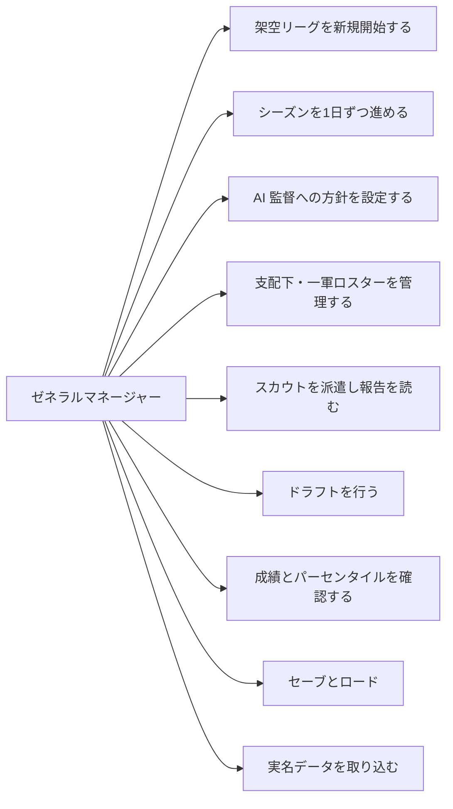

# 製品要求（Product Requirements）

| | |
|---|---|
| 文書 | `docs/product-requirements.ja.md`（英文版: `docs/product-requirements.md`） |
| 状態 | ドラフト v0.1、2026-09-17、承認待ち |
| 範囲 | hayakaze_sim が**何であるか**を定義する。どう作るかは `functional-design.md` と `architecture.md` に書く |
| 出典 | 2026-09-15/16/17 に確定した設計決定、エンジン検証プロトタイプ（`prototype/`）、プロジェクトメモリに記録した NPB の較正・制度調査 |

## 1. プロダクトビジョン

hayakaze_sim は、ブラウザで動く日本プロ野球（NPB）のペナントレース・シミュレーションであり、プレイヤーは1球団の
**ゼネラルマネージャー（GM）**である。プレイヤーはロスターを編成し、監督への方針を定め、アマチュアをスカウトして
ドラフトで指名し、143試合のシーズンが1日ずつ進むのを見守る。リーグは**既定で架空**である。本拠地の都市と
リーグ構成は NPB と同一だが、球団名と選手は架空である。

本プロダクトは3本の柱に立つ。アクション志向の国産野球ゲーム（パワプロ／プロスピ系）と、MLB 中心の経営ゲーム
（Out of the Park Baseball）との差別化のために意図的に選んだものである。

1. **NPB の制度を忠実に再現する。** 中6日の6人ローテーション、登録抹消後10日の再登録制限、支配下70名枠、
   ドラフト1巡目の入札抽選、交流戦、クライマックスシリーズ。これらは飾りではなく、GM が従う制約そのものである。
2. **説明可能なシミュレーション。** プレイヤーが見るすべての数字は仕組みまで辿れ、リーグ全体の成績は実際の NPB の
   水準に較正されている。セイバーメトリクス指標（wOBA、wRC+、FIP、WAR）は公開されている定数を借りるのではなく、
   シミュレーション自身の打席記録から導出する。
3. **情報がゲームである。** プレイヤーを含め、誰も選手の真の能力を見ることはできない。GM が見るのは観測で研がれる
   推定値、バイアスを持つスカウト、そして独自の推定を抱える他球団である。ロスターの判断は不確実性の下で行われ、
   スカウティングの報酬は「他の11球団が知らないことを知る」ことにある。

### 目的

- NPB ファンに、リズム・規則・成績の質感において**NPB のシーズンらしく感じられる**経営ゲームを提供する。
- シミュレーションを**信頼できるもの**にする。数字を読み込むプレイヤーは整合性を見出し、数字を無視する
  プレイヤーにもそれらしい結果が返る。
- **選手評価を中心的なスキル**にする。勝利は隠れた数値を画面から読み取ることではなく、AI 球団より人を見る目が
  優れていることから生まれる。

## 2. 対象ユーザー

### 主対象: チーム作りを楽しむ NPB ファン

NPB を熱心に追い、「中6日」「支配下登録」の意味を知っており、Out of the Park Baseball や Football Manager の
ような経営ゲームを遊んだことがある、あるいは遊びたいと思っている日本語話者のファン。

| 現在の問題 | 必要なもの |
|---|---|
| 国産野球ゲームはアクションが主で、GM 要素は浅いか抽象化されている（登録抹消も、入札抽選も、交流戦日程もない） | NPB の制度が実際のルールとして働くゲーム |
| OOTP は MLB 中心。NPB は後付けで、UI は英語、ロスター運用は MLB 式 | NPB ネイティブの設計と日本語 UI |
| 既存ゲームの能力値は見える真値であり、選手評価は「読む」だけで「見極める」ではない | 隠された真の能力、動く推定値、投資する価値のあるスカウト |
| 実名の権利問題が趣味プロジェクトの配布を制約する | NPB らしさを保った架空リーグと、ユーザー自身による実名データの取り込み |

### 副対象: セイバーメトリクス志向のファン

FanGraphs や DELTA を読み、WAR・wRC+・得点期待値がゲーム自身から計算され、Statcast 風のパーセンタイル表示で
見られることを望むファン。

| 現在の問題 | 必要なもの |
|---|---|
| ゲームが見せるのは打率と防御率で、高度な指標があっても装飾にすぎない | シミュレーション自身のイベントから導出した wOBA、wRC+、FIP、WAR、RE24 |
| ゲームの成績が現実的かどうかを確認する手段がない | 実際の NPB 水準への較正が文書化され、テストで検証できること |

### シーズン1では対象としないもの

- 一打席・一球単位で操作したいプレイヤー（アクション性）。
- マルチプレイやオンラインリーグ。
- 製品に同梱された NPB の実名データ。

## 3. スコープ: シーズン1と後続フェーズ

「シーズン1」は最初にプレイ可能なリリースである。契約と金銭を足す前に、中核ループ（シーズン、ロスター、成長、
スカウト、ドラフト）を完成させ較正するため、意図的に範囲を絞っている。

| 領域 | シーズン1 | 後続フェーズ |
|---|---|---|
| リーグ構成 | NPB 準拠の既定: 12球団、2リーグ各6球団、143試合、交流戦、クライマックスシリーズ、日本シリーズ。構成はコードではなくデータ | 球団追加、リーグ再編をプレイヤーのオプションとして |
| 指名打者 | 両リーグ DH。試合中の DH 解除は AI 監督が判断 | — |
| 試合シミュレーション | Odds Ratio 法による打席単位の完全シミュレーション、疲労、盗塁、失策、ブルペンの役割 | 打球の質の中間層、守備機会、守備 WAR、捕手フレーミング |
| ロスター | 開始時支配下65名、上限70名、一軍登録31名（ベンチ26名）、一軍登録の外国人枠、抹消後10日ルール、シーズン中の自由契約、引退 | 育成契約と育成ドラフト、新規外国人選手の獲得 |
| 二軍 | 簡易層: 試合をシミュレートせず能力値から二軍成績を生成 | 二軍試合の本格シミュレーション |
| 選手の成長 | 上限値（Present/Future）、7つの成長型、隠しポテンシャル、加齢、故障（離脱日数のみ） | コーチ、プロ意識ほか隠し特性を見えるシステムとして |
| スカウト | 3層モデル（真値／推定／表示）、獲得前の 20-80 グレード、スカウトのバイアスとクロスチェック、他球団選手の公開推定 | — |
| ドラフト | 1巡目入札抽選、スネーク方式、アマチュア4区分、AI の入札戦略 | 指名拒否、育成ドラフト |
| 契約と金銭 | なし。年俸、FA、ポスティング、トレードはいずれもなし | 年俸、契約志向、補償付き FA、ポスティング、トレード、代理人 |
| 成績 | 伝統的な成績に加え wOBA、wRC+、FIP、WAR、RE24 と線形ウェイト。Savant 風パーセンタイル | 守備指標 |
| プラットフォーム | ブラウザ、完全クライアントサイド、GitHub Pages、ブラウザ内保存とファイル書き出し | Tauri によるデスクトップ化 |
| データ | 架空リーグの生成。ユーザーが用意した JSON/CSV からの実名データ取り込み | — |

## 4. 主要機能（シーズン1）

### F1. 架空リーグの生成

新規ゲームは NPB の実在する本拠地都市に12球団を生成する。球団名は「町名＋カタカナのニックネーム」（例: 水道橋ラビッツ）、
球場名は「地名＋ドーム／スタジアム／球場」の架空名である。実在の球団ニックネームや球場名は使わない。各球団は階層
（主力、レギュラー、控え、二軍）、ポジション構成、球団間の戦力差を持つ支配下65名のロスターを受け取る。生成は
シード付きで再現可能である。

### F2. シーズンと日次ティック

時間は**日**単位で進む。毎日、その日の試合がシミュレートされ、疲労が蓄積・回復し、故障が発生・治癒し、GM は日と日の
間に行動できる。日程はリーグ設定から導出する（NPB 既定: 同一リーグの各球団と25試合、他リーグの各球団と3試合、
計143試合）。シーズンはクライマックスシリーズと日本シリーズで終わる。

### F3. 試合シミュレーション

各打席は打者と投手の能力値とリーグ平均から Odds Ratio 法で決定する。走者、盗塁、失策、投手交代、球数、疲労を
シミュレートする。両リーグが DH を採用し、AI 監督は試合中に DH を解除できる。エンジンはリーグ全体の成績が近年の
NPB のレンジに収まるように較正されている（第7節）。

### F4. AI 監督と GM の方針

GM は打席を采配しない。AI 監督が打順（予告先発に対するプラトーン起用を含む）を組み、6人ローテーションを回し、
ブルペンの役割を割り当て、イニング境界と球数から投手交代を判断する。GM は**方針**を定める。球数上限、エースの扱い、
走塁の積極性である。AI 監督が読むのは球団が持つ**推定値**であり、真値ではない。

### F5. ロスター管理

GM は支配下70名と一軍登録31名を管理する。登録と抹消（再登録まで10日）、スタミナの低い先発の「投げ抹消」、シーズン中の
自由契約、年齢・衰え・出場機会・故障・契約満了を引き金とする引退である。登録枠は現行の運用値を既定とする設定である
（一軍31名、ベンチ26名。協約値は29名）。

外国人選手は一軍登録の**外国人枠**に数える。既定は5名（協約値は4名）で、投手のみ、あるいは野手のみで枠を埋められ
ないように内訳制限を持つ。支配下には外国人の人数制限はない。枠の除外条件を満たす選手（例: 日本の高校に通算3年）は
除外フラグを持ち、枠に数えない。シーズン1では外国人選手は生成されたロスターに存在し枠の対象となる。新規の外国人
選手の獲得は契約システムとともに導入する。

### F6. 選手の成長と加齢

すべての能力値に**上限値**があり、成長は上限に漸近し超えない。いつ成長するかは7つの**成長型**（標準、早熟、晩成、
持続、早熟持続、急伸急落、晩年開花）のいずれかが決め、どれだけ速く成長するかは成績と出場機会の剥奪に反応する隠しの
**ポテンシャル**が決める。加齢による衰えはポテンシャルと無関係で、公開されている加齢カーブより緩やかにする。
生存者バイアスはシミュレーション内部で自然に発生するからである。クラッチは加齢しない。

### F7. 疲労と故障

疲労は2層である。球数で減る試合内のスタミナと、日ごとに回復する蓄積疲労である。故障は離脱期間のみを持ち
（部位なし）、離脱日数は右裾の重い分布に従い、リスクは主に故障歴で決まる。1試合115〜120球超の閾値効果と、
速球の球速との連動を持つ。野手も連続出場で疲労し、捕手はとくに重い。

### F8. スカウトと情報

すべての選手は3層を持つ。誰も見ない**真値**、球団ごとに別々に持つ**推定**、そして**表示**である。獲得前は GM に
Present/Future 形式（55/70）の 20-80 グレードが見える。スカウトは能力ごとの観測ノイズと持続的なバイアスを持つため、
複数スカウトによるクロスチェックに意味がある。獲得後、自球団選手の基礎能力は50打席または2か月（投手は対戦打者100人）
で判明し、正確な数値で表示される。上限値、ポテンシャル、成長型、隠し特性は判明しない。他球団の選手は成績から導いた
公開推定を通してのみ見える。確信度は視覚的に伝え、数値では示さない。

### F9. 新人ドラフト

ドラフトは NPB の手順に従う。1巡目は同時入札で決まり、同じ選手に入札した球団間で抽選し、全球団の指名が確定するまで
繰り返す。以後は順位に基づくスネーク方式で、優先リーグは年ごとに交代する。アマチュアは4区分（高校、大学、社会人、
独立リーグ）で、年齢・現在能力・上限値の分布が異なる。AI 球団は他球団の入札を推定して期待値を最大化する指名を
行うため、競合率と単独指名率が実際の NPB の実績に一致する。

### F10. 成績と表示

全選手・全球団の伝統的な成績。シミュレーション自身の打席イベントから導出した得点期待値と線形ウェイトによる
wOBA、wRC+、FIP、WAR。能力値と成績の両方に Baseball Savant 風のパーセンタイルバー。リーグリーダーと順位表。

### F11. セーブとロード

ゲームはブラウザ内で保存・再開でき、ファイルとして書き出せる。乱数の状態はセーブに含まれ、ロードして無関係な判断を
変えても他の試合の結果を引き直せないようにシミュレーションを構成する。

### ユースケース

## 5. 成功の定義

以下がすべて成り立つとき、シーズン1は成功である。

1. **較正。** 6シード以上のシーズンにわたる自動テストが、リーグ全体の水準が第7.1節の NPB 目標レンジに、
   起用・疲労・ロスター移動の指標が第7.2節のレンジに収まることを示す。
2. **成長のリアリティ。** Future グレード別に集計したシミュレーション上のプロスペクトが、FanGraphs の結果分布
   （消滅／控え／レギュラー／平均超／スター）を順序プロビットモデルの適合度で再現する。バスト用の特別処理を使わない。
3. **ドラフトのリアリティ。** 1巡目で単独指名となる球団が平均約3.3、競合グループが平均約2.8組で平均サイズ約3.1球団、
   入札ラウンド数が2〜4回になる。
4. **情報のゲームが機能する。** スカウトに投資した球団は、投資しない球団に対してドラフトで測定可能な優位を得る。
   その優位は抽選に勝つことではなく、他球団が過小評価した選手の指名から生まれる。
5. **説明可能性。** 表示されるすべての指標に、それを生む仕組みの文書があり、文書の読者がイベントログから再現できる。
6. **プレイ可能性。** ドラフトを含む1シーズンをバックエンドなしでブラウザ上でプレイでき、ゲーム状態全体を保存・
   書き出し・復元できる。

## 6. ビジネス要件

- **配布。** GitHub Pages 上の静的サイトとして無償配布する。サーバーなし、アカウントなし、テレメトリなし。
- **権利。** 実名の選手名、実在の球団ニックネーム、実在の球場名は同梱しない。本拠地の都市は実在のものを使う。
  ユーザーは自分で用意した実名データを取り込めるが、製品がそれを配布することはない。
- **言語。** ゲームの UI は日本語。リポジトリの文書は英文で、日本語版を併置する。
- **持続性。** 開発者1名と AI アシスタントによる趣味規模のプロジェクト。エンジンは UI から独立させ、ヘッドレスで
  検証でき、後にデスクトップ向けにパッケージできるようにする。
- **ライセンスと収益化。** 未決定。シーズン1では収益化を計画しない。

## 7. 受け入れ条件

### 7.1 リーグ水準の較正（近年の NPB）

固定6シードの自動テストでアサートする。6シード平均が目標内に、各シードが目標を許容幅だけ広げた帯内に入ること。

| 指標 | 目標 |
|---|---|
| 打率 | .240〜.260 |
| 出塁率 | .305〜.325 |
| OPS | .660〜.715 |
| 1試合平均得点（1チーム） | 3.6〜4.3 |
| 防御率 | 3.00〜3.60 |
| WHIP | 1.24〜1.35 |
| 三振率 | 18〜21% |
| 四球率 | 7.5〜9% |
| 本塁打率 | 2.0〜2.6% |
| 盗塁企図（1チーム） | 105〜110 |
| 盗塁成功率 | .65〜.75 |
| 盗塁阻止率（リーグ） | .30〜.33 |
| 首位打者 | .320〜.350 |
| 本塁打王 | 30〜40 |
| 規定投球回の先発 防御率 σ | 約0.65 |
| 規定打席の打者 OPS σ | 約.090 |
| チーム勝率の幅 | .40〜.60 |

### 7.2 起用・疲労・ロスター移動

| 項目 | 目標（注記なければ1チーム1シーズン） |
|---|---|
| 先発1試合あたりの投球回と球数 | 5.8〜6.2回、93〜103球 |
| 先発の登板間隔（全先発） | 中6日 49〜53%、中7〜8日 16〜20%、中10日以上 22〜23%、中5日以下 3〜4% |
| 上位6人の先発の占める割合 | 全先発の約80% |
| 完投 | 6〜8回 |
| シーズン最多の1試合球数 | 137〜143球 |
| シーズン使用投手数 | 28〜30人 |
| 救援の2連投 | 主力救援の登板の18〜19% |
| 救援の3連投 | 1〜2回 |
| 救援の4連投以上 | 0回 |
| 故障者リスト入り件数 | 21〜26件（投手が約55%） |
| 1件あたりの離脱日数 | 平均約50日、中央値11〜20日、右裾が重い |

### 7.3 成長とドラフト

- Future グレード別のプロスペクト結果が FanGraphs の表（FV 45/50/55/60）に順序プロビットモデルで適合する。
  消滅は3年後の WAR 0.5未満で定義する。
- 投手プロスペクトの結果分散は野手より大きい。
- ドラフト1巡目の競合統計は第5節の項目3のとおり。
- 能力別のピーク年齢は NPB の順序に従う。走力と球速が最も早く、パワーと守備が25〜27歳前後、四球率が最も遅い。

### 7.4 情報モデル

- 真の能力値は表示されず、AI 監督や AI 球団の判断にも読まれない。
- 獲得前のグレードは5刻みの 20-80 で Present/Future 形式。内部の 1〜99 との対応は 1:1（平均50、σ10）。
- 自球団選手の基礎能力は50打席または2か月（投手は対戦打者100人または2か月）でちょうど判明する。上限値、
  ポテンシャル、成長型、隠し特性は判明しない。
- 他球団の選手は公開推定を通してのみ表示される。
- 確信度は視覚的な濃淡で示し、数値では示さない。

### 7.5 エンジンの健全性

- ある試合の乱数消費を変えても、同日の他の全試合と、翌日のうち当該2球団が関わらない試合は変わらない。
- 乱数状態を書き出して復元すると、以後の乱数列が完全に一致する。
- エンジン内で `Math.random()` を使わない。
- 球団数、リーグ数、リーグごとの球団数は設定から読む。エンジン内に 12、2、6 をハードコードしない。

## 8. ユーザーストーリー

| ID | GM として、…したい | それによって… |
|---|---|---|
| US-01 | 実在の都市と架空の球団で新しいリーグを始めたい | 権利の心配なくすぐに遊べる |
| US-02 | シーズンを1日ずつ進めて結果を見たい | シーズンが本物の NPB のリズムを持つ |
| US-03 | 試合ごとの采配ではなく球数やエースの扱いの方針を決めたい | ベンチの判断ではなく GM の判断をする |
| US-04 | 10日ルールの下で選手を登録・抹消したい | ロスター管理に本物の NPB の制約がある |
| US-05 | アマチュアの 20-80 Present/Future グレードを確信度の濃淡付きで見たい | 不確実性の下でプロスペクトを見極める |
| US-06 | 同じ選手に複数のスカウトを派遣したい | バイアスのある報告をクロスチェックできる |
| US-07 | 十分に出場した自球団選手の正確な基礎能力を見たい | 手持ちを把握しつつ将来には不確実性が残る |
| US-08 | 他球団の選手を公開推定だけで見たい | 他球団の選手評価が「調べる」ではなく「見極める」になる |
| US-09 | 1巡目抽選のあるドラフトに参加したい | ドラフトが NPB のドラフトらしく感じられる |
| US-10 | シミュレーションから導出した WAR、wRC+、パーセンタイルを見たい | アナリストと同じやり方で選手を評価できる |
| US-11 | ゲームを保存・書き出し・再開したい | セッションや端末をまたいで遊べる |
| US-12 | 自分で用意した実名データを取り込みたい | データがあれば実在選手で遊べる |
| US-13 | それぞれの数字を生む仕組みを読みたい | シミュレーションを信頼できる |

## 9. 機能要件

### FR-1 リーグと日程

- FR-1.1 リーグ設定（球団、リーグ、リーグごとの DH、カードあたり試合数）はデータである。球団あたり試合数、
  規定到達の閾値、順位表、ドラフト指名順はそこから導出する。
- FR-1.2 既定設定: 12球団、2リーグ各6球団、同一リーグ25試合・交流戦3試合のカード、両リーグ DH。
- FR-1.3 ポストシーズン: 各リーグのクライマックスシリーズと、それに続く日本シリーズ。
- FR-1.4 ドラフト指名順は公式戦順位のみから導出する。リーグ間で正規化し、2リーグ同数では NPB の手順と一致し、
  不均等なリーグ数でも破綻しない。

### FR-2 試合シミュレーション

- FR-2.1 打席は8結果（K、BB、HBP、HR、3B、2B、1B、インプレーのアウト）に対する Odds Ratio 法で決定する。
- FR-2.2 能力値は 1〜99 で、50 は実際に出場している選手の平均と定義する。水準はリーグ平均の結果分布で、
  散らばりは能力ごとの傾きで固定する。
- FR-2.3 得点圏に走者がいるとき、打者のミートと投手の被安打能力にクラッチ係数を乗じる。係数はクラッチ50で 1.0。
- FR-2.4 AI 監督はイニング境界と球数で投手を交代し、GM の方針を入力とする。
- FR-2.5 走者は進塁し、盗塁し、刺される。失策が発生する。自責点と非自責点を区別する。
- FR-2.6 すべての打席をイベント（前後の状態、結果）として記録し、シーズン状態とは分けて保存する。

### FR-3 ロスターと移動

- FR-3.1 支配下は上限70名、開始時65名。一軍登録は31名でベンチ26名。いずれも設定可能。
- FR-3.2 抹消すると、抹消日を含めて10日間は再登録できない。
- FR-3.3 スタミナや耐久性の低い先発の投げ抹消は AI が判断する。
- FR-3.4 シーズン中の自由契約は GM と AI 球団の双方が行える。
- FR-3.5 引退は年齢、衰え、出場機会の減少、大きな故障、契約満了を引き金とし、個人の隠し特性「引き際」が調整する。
- FR-3.6 二軍選手は試合シミュレーションなしに、期間ごとに能力値から生成した成績を受け取る。予測力は指標ごとに
  異なる（三振率・四球率は高く、打率は低く、投手の防御率はほぼゼロ）。
- FR-3.7 一軍登録の外国人枠: 合計（既定5名、協約値4名）と、投手のみ・野手のみで枠を埋めることを禁じる内訳制限を
  持ち、いずれも設定可能な定数である。除外選手は数えない。枠を超える登録は GM に対して拒否し、AI 球団は試みない。

### FR-4 選手モデル

- FR-4.1 打者: ミート（対左／対右）、パワー、コンタクト、選球眼、走力、肩、ポジション別守備（9ポジション。DH は
  守備位置ではなく打順の枠）、クラッチ、耐久。捕手はさらにポップタイムとブロッキング。
- FR-4.2 投手: 球種ごとの球速・変化・制球（球種構成）から H/9、HR/9、K/9、BB/9 を導出する。スタミナ、回復力、
  クラッチ、耐久。
- FR-4.3 ツールごとの上限値とソフトキャップ型の成長。頻度が不均等な7つの成長型。成績で上がり、不振と出場機会の
  欠如で下がる隠しポテンシャル。上限値は生涯固定。
- FR-4.4 加齢はポテンシャルと独立で、個人の「衰えにくさ」と「プロ意識」の特性を持つ。クラッチは加齢しない。
- FR-4.5 隠し特性（打球傾向、契約志向、プロ意識、引き際）は、そのシステムが後のフェーズで来るものであっても、
  シーズン1のデータモデルに存在する。
- FR-4.6 すべての選手は外国人区分（国内／外国人／外国人だが枠除外）を持つ。リーグ生成は各球団のロスターに現実的な
  人数の外国人選手を配置する。取り込みデータでは区分を直接指定できる。

### FR-5 スカウトと推定

- FR-5.1 各球団はすべての選手について独自の推定（平均と不確実性）を持ち、観測で更新する。
- FR-5.2 スカウトの観測ノイズは能力（走力と球速は精密、ミート・選球眼・クラッチは不精密）とスカウトに依存する。
  各スカウトは持続的なバイアスも持つ。
- FR-5.3 成績から導いた公開推定は全球団で共有し、各球団が私的オフセットを加える。
- FR-5.4 自球団選手の基礎能力は50打席／対戦打者100人または2か月で正確になる。ゲーム開始時にロスターにいる選手は
  最初から正確である。
- FR-5.5 表示: 獲得前は5刻みの 20-80、判明後は正確な数値、他球団の選手は公開推定。確信度は視覚的な濃淡のみ。

### FR-6 ドラフト

- FR-6.1 1巡目: 同時入札、同じ選手に入札した球団間で抽選、外れた球団が再入札し、全球団の指名が確定するまで繰り返す。
  2巡目以降: 順位に基づくスネーク方式で、優先リーグは交代する。
- FR-6.2 1球団の指名は10名まで、全体で120名まで。球団は終了を宣言でき、以後は復帰できない。
- FR-6.3 アマチュアは4区分で、年齢・Present・上限値の分布が異なる。
- FR-6.4 AI 球団は他球団の入札を推定し期待値で指名先を選ぶ。競合統計は較正目標である。

### FR-7 成績

- FR-7.1 得点期待値（RE24）と線形ウェイトを、毎シーズン、シミュレーション自身のイベントから計算する。
- FR-7.2 wOBA、wRC+、FIP、WAR は FanGraphs の構造に従い、ポジション調整は NPB（DELTA）値を使う。
- FR-7.3 パーセンタイルは能力値と成績で同じ仕組みを使い、1〜100 で表す。
- FR-7.4 順位表、リーダー、球団と選手のページに伝統的な成績と高度な指標を載せる。

### FR-8 永続化とデータ

- FR-8.1 ブラウザストレージへの保存と、乱数状態を含むファイルの書き出し・読み込み。
- FR-8.2 ユーザーが用意した JSON/CSV からの実名選手・球団の取り込み。

## 10. 非機能要件

| ID | 要件 |
|---|---|
| NFR-1 | 現行の常緑ブラウザで完全にクライアントサイドで動作する。バックエンドなし、読み込み後の通信なし |
| NFR-2 | 一般的なノート PC で1日の進行が1秒を大きく下回る。858試合の公式戦1シーズンをヘッドレスで数秒以内にシミュレートする（プロトタイプ: 約130 ms） |
| NFR-3 | すべての乱数はシード付きで、同じシードと入力からは同じリーグとシーズンが再現される |
| NFR-4 | 乱数ストリームは用途別（試合、故障、スカウト、成長、AI）および試合別に独立している |
| NFR-5 | 複数シーズンのセーブサイズがブラウザストレージで実用的な範囲に収まる。打席イベントはシーズン状態と分けて保存し、間引きできる |
| NFR-6 | エンジンは UI に依存せず、自動較正テストとヘッドレス診断で検証される |
| NFR-7 | 較正の回帰は表を目で読むのではなく `npm test` で検知する |
| NFR-8 | UI の文言は日本語。数値の書式は NPB の慣例に従う（例: 打率 .285、防御率 2.85） |
| NFR-9 | 取り込みファイルの入力は検証し、データからスクリプトを実行しない |
| NFR-10 | `docs/` 配下の文書は英文で、日本語版を同期して併置する |

## 11. 先送りした決定

失われないようにここに記録する。それぞれ個別の steering 作業で決める。

- リポジトリおよびユーザー向け配布物のライセンス。
- トレードを契約システムより前に入れるか、一緒に入れるか。
- 運用値5名のもとでの外国人枠の内訳制限の正確な値（実装前に現行の NPB 運用規則と照合する）。
- 全球団が共有するアマチュアの公開推定層（甲子園の実績、大学リーグ、球速）。
- 捕手フレーミング。捕手の守備価値の最大成分であるのにモデルにない。
- 固定のリーグ平均アンカーを、毎プレシーズンに実出場層の加重平均で差し替えること（方針は決定済み。実装フェーズ）。
