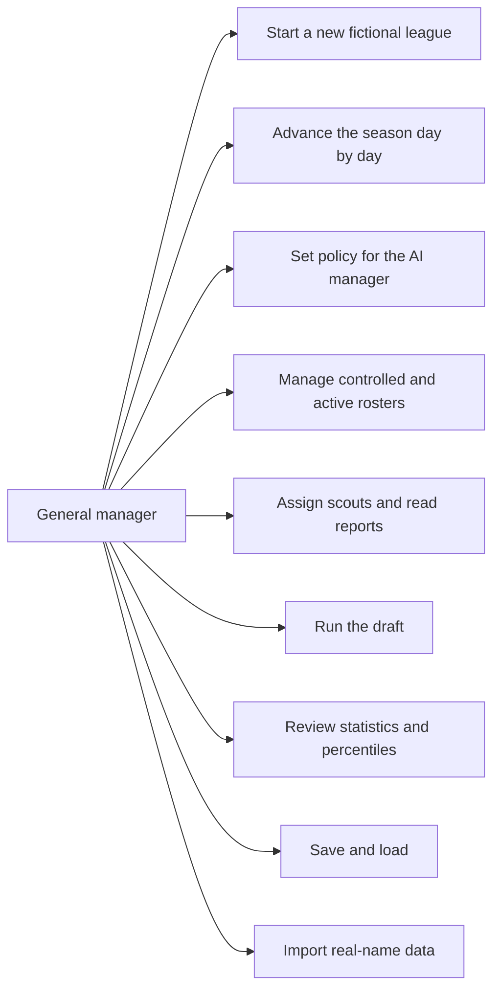

# Product Requirements

| | |
|---|---|
| Document | `docs/product-requirements.md` (Japanese: `docs/product-requirements.ja.md`) |
| Status | Draft v0.1, 2026-09-17, awaiting approval |
| Scope | Defines **what** hayakaze_sim is. How it is built lives in `functional-design.md` and `architecture.md` |
| Sources | Design decisions fixed on 2026-09-15/16/17, the engine validation prototype (`prototype/`), and the NPB calibration and institutional research recorded in project memory |

## 1. Product Vision

hayakaze_sim is a browser-based pennant-race simulation of Nippon Professional Baseball (NPB) in which the player is the
**general manager (GM)** of one club. The player builds the roster, sets policy for the field manager, scouts and drafts
amateurs, and watches a 143-game season unfold one day at a time. The league is **fictional by default**: real home cities
and a league structure identical to the NPB, but fictional club names and players.

The product stands on three pillars, chosen deliberately to differentiate it from action-oriented Japanese baseball games
(the Power Pros / Pro Spirits family) and from MLB-centric management games (Out of the Park Baseball):

1. **NPB institutions reproduced faithfully.** Six-man rotations on six days' rest, the ten-day deactivation rule, the
   70-man controlled roster, the first-round bidding lottery of the draft, interleague play, the Climax Series. These are
   not flavour text; they are the constraints the GM works within.
2. **An explainable simulation.** Every number the player sees can be traced to a mechanism, and the league-wide
   statistics are calibrated against real NPB levels. Sabermetric measures (wOBA, wRC+, FIP, WAR) are derived from the
   simulation's own play-by-play, not borrowed from published constants.
3. **Information as the game.** Nobody, including the player, sees a player's true ability. The GM sees estimates that
   sharpen with observation, scouts who are biased, and rival clubs holding estimates of their own. Roster decisions are
   made under uncertainty, and the payoff of scouting is knowing something the other eleven clubs do not.

### Purpose

- Give NPB fans a management game whose season **feels like an NPB season**, in its rhythms, rules and statistical texture.
- Make the simulation **trustworthy**: a player who studies the numbers should find them coherent, and a player who
  ignores them should still get plausible outcomes.
- Make **player evaluation the central skill**. Winning comes from judging people better than the AI clubs do, not from
  reading a hidden number off a screen.

## 2. Target Users

### Primary: NPB fans who enjoy team building

Japanese-speaking fans who follow NPB closely, know what "中6日" and "支配下登録" mean, and have played or wanted to play
management games such as Out of the Park Baseball or Football Manager.

| Problem today | Need |
|---|---|
| Japanese baseball titles are action-first. GM elements are shallow or abstracted (no deactivation, no draft lottery, no interleague scheduling) | A game where the NPB institutions are the actual rules |
| OOTP is MLB-centric. NPB is a bolt-on with an English UI and MLB-style roster mechanics | An NPB-native design with a Japanese UI |
| Ratings in existing games are visible true values. Player evaluation is reading, not judging | Hidden true ability, estimates that move, scouts worth investing in |
| Real-name licensing limits what a hobby project can ship | A fictional league that still feels like the NPB, with real-name data importable by the user |

### Secondary: sabermetrics-minded fans

Fans who read FanGraphs and DELTA, and want to see WAR, wRC+ and run expectancy computed from the game itself, with
Statcast-style percentile displays.

| Problem today | Need |
|---|---|
| Games show batting average and ERA; advanced metrics, if any, are cosmetic | wOBA, wRC+, FIP, WAR and RE24 derived from the simulation's own events |
| No way to check whether a game's statistics are realistic | Calibration against real NPB levels, documented and testable |

### Not targeted in Season 1

- Players who want to control individual at-bats or pitches (action gameplay).
- Multiplayer or online leagues.
- Real-name NPB data bundled with the product.

## 3. Scope: Season 1 and Later Phases

"Season 1" is the first playable release. It is deliberately bounded so that the core loop (season, roster, development,
scouting, draft) is complete and calibrated before contracts and money are added.

| Area | Season 1 | Later phases |
|---|---|---|
| League structure | NPB-conformant default: 12 clubs, 2 leagues of 6, 143 games, interleague, Climax Series, Japan Series. Structure is data, not code | Expansion clubs, league realignment as player options |
| Designated hitter | DH in both leagues. Mid-game loss of the DH decided by the AI manager | — |
| Game simulation | Full plate-appearance simulation with the Odds Ratio Method, fatigue, steals, errors, bullpen roles | Batted-ball quality layer, fielding chances, fielding WAR, catcher framing |
| Roster | 65 controlled players at start, 70-man cap, 31-man active roster (26 in the dugout), foreign-player quota on the active roster, 10-day deactivation rule, in-season release, retirement | Developmental (ikusei) contracts and draft, acquisition of new foreign players |
| Farm team | Simplified layer: farm statistics generated from ratings without simulating games | Full farm-game simulation |
| Player development | Caps (Present/Future), seven growth types, hidden potential, aging, injuries (days out only) | Coaches, professionalism and other hidden traits as visible systems |
| Scouting | Three-layer model (true / estimated / displayed), 20–80 grades before acquisition, scout bias and cross-checking, public estimates for other clubs' players | — |
| Draft | First-round bidding lottery, snake rounds, four amateur categories, AI bidding strategy | Draft refusal, developmental draft |
| Contracts and money | None. No salaries, no free agency, no posting, no trades | Salaries, contract preferences, FA with compensation, posting, trades, agents |
| Statistics | Traditional lines plus wOBA, wRC+, FIP, WAR, RE24 and linear weights; Savant-style percentiles | Fielding metrics |
| Platform | Browser, fully client-side, GitHub Pages, save in the browser and as an exportable file | Desktop packaging with Tauri |
| Data | Fictional league generation. Import of real-name data from user-supplied JSON/CSV | — |

## 4. Main Features (Season 1)

### F1. Fictional league generation

A new game generates twelve clubs in real NPB home cities, each with a fictional name of the form "town name + katakana
nickname" (for example 水道橋ラビッツ) and a fictional ballpark named "place + ドーム / スタジアム / 球場". No real club
nickname or ballpark name is used. Each club receives a 65-man controlled roster with tiers (stars, regulars, bench,
farm), positional profiles and team-strength differences. Generation is seeded and reproducible.

### F2. Season and daily tick

Time advances in **days**. Each day the scheduled games are simulated, fatigue accumulates and recovers, injuries occur
and heal, and the GM may act between days. The schedule is derived from the league configuration (NPB default: 25 games
against each same-league club and 3 against each other-league club, 143 in total). The season ends with the Climax Series
and the Japan Series.

### F3. Game simulation

Each plate appearance is resolved with the Odds Ratio Method from the batter's and pitcher's ratings and the league
average. Runners, steals, errors, pitching changes, pitch counts and fatigue are simulated. Both leagues use the DH; the
AI manager may give up the DH during a game. The engine is calibrated so that league-wide statistics fall within recent
NPB ranges (section 7).

### F4. AI field manager and GM policy

The GM does not manage at-bats. An AI manager builds the lineup (including platoon use against the announced starting
pitcher), runs the six-man rotation, assigns bullpen roles and decides pitching changes on inning boundaries and pitch
counts. The GM sets **policy**: pitch-count limits, treatment of the ace, running aggressiveness. The AI manager reads the
club's **estimated** ratings, not true values.

### F5. Roster management

The GM manages the 70-man controlled roster and the 31-man active roster: registration and deactivation (ten days before
re-registration), "pitch-and-deactivate" for low-stamina starters, in-season release, and retirement driven by age,
decline, playing time, injury and contract expiry. Registration limits are settings with the current operating values as
defaults (31 active, 26 dugout; the collective-agreement value is 29).

Foreign players count against a **foreign-player quota** on the active roster: 5 by default (the collective-agreement
value is 4), with a breakdown limit so that the quota cannot be filled entirely with pitchers or entirely with position
players. The controlled roster has no foreign-player limit. Players who qualify for exemption (for example three years at
a Japanese high school) carry an exemption flag and do not count. In Season 1 foreign players exist on the generated
rosters and are subject to the quota; acquiring new foreign players arrives with the contract system.

### F6. Player development and aging

Every rating has a **cap**; growth approaches the cap and never exceeds it. When a player grows is governed by one of
seven **growth types** (standard, early, late, sustained, early-sustained, spike-and-fall, late-bloom). How fast is
governed by a hidden **potential** that responds to performance and to being denied playing time. Aging declines are
independent of potential and gentler than published aging curves, because survivor bias arises inside the simulation on
its own. Clutch does not age.

### F7. Fatigue and injuries

Fatigue has two layers: in-game stamina that shrinks with pitch count, and accumulated fatigue that recovers daily.
Injuries have a duration only (no body parts), a right-skewed distribution of days out, and a risk driven mainly by
injury history, with a threshold effect for single-game pitch counts above 115–120 and a link to fastball velocity.
Position players and especially catchers fatigue with consecutive games.

### F8. Scouting and information

Every player has three layers: a **true value** nobody sees, an **estimate** held separately by each club, and a
**display**. Before acquisition, the GM sees 20–80 grades in Present/Future form (55/70). Scouts have per-rating
observation noise and a persistent bias, so cross-checking with several scouts is meaningful. After acquisition, the base
ratings of the GM's own players become known after 50 plate appearances or two months (pitchers: 100 batters faced), and
are shown as exact numbers; caps, potential, growth type and hidden traits remain unknown. Other clubs' players are shown
through a public estimate derived from their statistics. Confidence is conveyed visually, never as a number.

### F9. Amateur draft

The draft follows the NPB procedure: a first round decided by simultaneous bids and a lottery among clubs that bid on the
same player, repeated until every club has a pick, then snake rounds ordered by league standing with the priority league
alternating by year. Amateurs come in four categories (high school, university, industrial league, independent league)
with different age, present-ability and cap distributions. AI clubs estimate rival bids and pick to maximise expected
value, so contention and single-bid rates match real NPB history.

### F10. Statistics and display

Traditional statistics for every player and club; wOBA, wRC+, FIP and WAR computed from run expectancy and linear weights
derived from the simulation's own plate-appearance events; Baseball Savant-style percentile bars for both ratings and
statistics; league leaders and standings.

### F11. Save and load

A game can be saved and resumed in the browser and exported as a file. Random-number state is part of the save, and the
simulation is arranged so that reloading and changing an unrelated decision cannot re-roll the outcome of other games.

### Use cases

## 5. Definition of Success

Season 1 is successful when all of the following hold.

1. **Calibration.** Automated tests over at least six seeded seasons show league-wide levels within the NPB target
   ranges of section 7.1, and the usage, fatigue and roster-movement measures within the ranges of section 7.2.
2. **Development realism.** Simulated prospects, grouped by Future grade, reproduce the FanGraphs outcome distribution
   (bust / bench / regular / above average / star) to the fit of an ordinal probit model, without special-case bust rules.
3. **Draft realism.** The first round produces on average about 3.3 single-bid clubs, about 2.8 contention groups of
   average size about 3.1, and 2–4 bidding rounds.
4. **Information gameplay works.** A club that invests in scouting gains a measurable draft advantage over one that does
   not, and the advantage comes from picks the other clubs undervalued, not from winning lotteries.
5. **Explainability.** Every displayed metric is documented with the mechanism that produces it, and a reader of the
   documentation can reproduce it from the event log.
6. **Playability.** A full season including the draft can be played in the browser without a backend, and a complete
   game state can be saved, exported and restored.

## 6. Business Requirements

- **Distribution.** Free of charge as a static site on GitHub Pages. No server, no account, no telemetry.
- **Rights.** No real player names, real club nicknames or real ballpark names are bundled. Real home cities are used.
  Users may import real-name data they provide themselves; the product never distributes it.
- **Language.** The game UI is Japanese. Repository documents are English with Japanese counterparts.
- **Sustainability.** A hobby-scale project maintained by one developer with an AI assistant. The engine is kept
  independent of the UI so that it can be validated headlessly and later packaged for desktop.
- **Licence and monetisation.** Not decided. No monetisation is planned for Season 1.

## 7. Acceptance Criteria

### 7.1 League-level calibration (recent NPB)

Asserted by automated tests over six fixed seeds: the six-seed mean lies inside the target and each seed lies inside the
target widened by a tolerance.

| Metric | Target |
|---|---|
| Batting average | .240–.260 |
| On-base percentage | .305–.325 |
| OPS | .660–.715 |
| Runs per team-game | 3.6–4.3 |
| ERA | 3.00–3.60 |
| WHIP | 1.24–1.35 |
| Strikeout rate | 18–21% |
| Walk rate | 7.5–9% |
| Home-run rate | 2.0–2.6% |
| Stolen-base attempts per team | 105–110 |
| Stolen-base success | .65–.75 |
| Caught-stealing rate (league) | .30–.33 |
| Batting champion | .320–.350 |
| Home-run leader | 30–40 |
| ERA σ of qualified starters | about 0.65 |
| OPS σ of qualified batters | about .090 |
| Team win% range | .40–.60 |

### 7.2 Usage, fatigue and roster movement

| Item | Target (per team-season unless noted) |
|---|---|
| Innings and pitches per start | 5.8–6.2 innings, 93–103 pitches |
| Start intervals (all starts) | 6 days' rest 49–53%, 7–8 days 16–20%, 10+ days 22–23%, 5 or fewer 3–4% |
| Starts by the top six starters | about 80% of all starts |
| Complete games | 6–8 |
| Season maximum pitches in a game | 137–143 |
| Pitchers used in a season | 28–30 |
| Relievers on 2 consecutive days | 18–19% of key relievers' appearances |
| Relievers on 3 consecutive days | 1–2 occurrences |
| Relievers on 4 or more consecutive days | 0 |
| Injured-list entries | 21–26 (pitchers about 55%) |
| Days out per injury | mean about 50, median 11–20, right-skewed |

### 7.3 Development and draft

- Prospect outcomes by Future grade fit the FanGraphs table (FV 45/50/55/60) under an ordinal probit model; bust is
  defined as WAR below 0.5 three years later.
- Pitcher prospects show wider outcome variance than position players.
- Draft first-round contention statistics as in section 5, item 3.
- Peak ages by skill follow the NPB order: speed and velocity earliest, power and fielding around 25–27, walk rate latest.

### 7.4 Information model

- True ratings are never displayed and never read by the AI manager or AI clubs' decisions.
- Before acquisition, grades are 20–80 in steps of 5 with Present/Future; the mapping to the internal 1–99 scale is 1:1
  (mean 50, σ 10).
- Own players' base ratings are revealed exactly after 50 PA or 2 months (pitchers 100 BF or 2 months); caps, potential,
  growth type and hidden traits are not.
- Other clubs' players are shown only through the public estimate.
- Confidence is shown by visual weight, not by a number.

### 7.5 Engine integrity

- Changing the random-number consumption of one game leaves all other games of that day, and next-day games not involving
  the two clubs, unchanged.
- Serialising and restoring random-number state reproduces the same sequence exactly.
- `Math.random()` is not used inside the engine.
- Club count, league count and clubs per league are read from configuration; nothing in the engine hard-codes 12, 2 or 6.

## 8. User Stories

| ID | As a GM, I want… | so that… |
|---|---|---|
| US-01 | to start a new fictional league with real cities and made-up clubs | I can play immediately without licensing concerns |
| US-02 | to advance the season one day at a time and see the results | the season has the rhythm of a real NPB season |
| US-03 | to set pitch-count and ace-handling policy rather than manage each game | I make GM decisions, not bench decisions |
| US-04 | to register and deactivate players under the ten-day rule | roster management has real NPB constraints |
| US-05 | to see 20–80 Present/Future grades on amateurs with visual confidence | I judge prospects under uncertainty |
| US-06 | to assign several scouts to the same player | I can cross-check biased reports |
| US-07 | to see my own players' exact base ratings once they have played enough | I know what I have while remaining uncertain about their future |
| US-08 | to see rival clubs' players only through public estimates | evaluating other clubs' players is a judgment, not a lookup |
| US-09 | to take part in a draft with a first-round lottery | the draft feels like the NPB draft |
| US-10 | to see WAR, wRC+ and percentiles derived from the simulation | I can evaluate players the way analysts do |
| US-11 | to save, export and resume a game | I can play across sessions and devices |
| US-12 | to import real-name data I supply | I can play with real players if I have the data |
| US-13 | to read what mechanism produces each number | I can trust the simulation |

## 9. Functional Requirements

### FR-1 League and schedule

- FR-1.1 The league configuration (clubs, leagues, DH per league, games per matchup) is data. Games per club,
  qualifying thresholds, standings and draft order derive from it.
- FR-1.2 Default configuration: 12 clubs, 2 leagues of 6, 25 same-league and 3 interleague games per matchup, DH in both.
- FR-1.3 Postseason: Climax Series in each league followed by the Japan Series.
- FR-1.4 The draft order derives from regular-season standings only, normalised across leagues so it matches the NPB
  procedure for two equal leagues and does not break for unequal ones.

### FR-2 Game simulation

- FR-2.1 Plate appearances resolve by the Odds Ratio Method over eight outcomes (K, BB, HBP, HR, 3B, 2B, 1B, out in play).
- FR-2.2 Ratings are 1–99 with 50 defined as the average of players who actually play. Level is anchored by the
  league-average outcome distribution; spread by per-rating slopes.
- FR-2.3 With runners in scoring position, batter meet and pitcher hit rating are multiplied by a clutch factor equal
  to 1.0 at clutch 50.
- FR-2.4 The AI manager changes pitchers on inning boundaries and pitch counts, with GM policy as input.
- FR-2.5 Runners advance, steal and are caught; errors occur; earned and unearned runs are distinguished.
- FR-2.6 Every plate appearance is recorded as an event (state before and after, outcome), stored separately from
  the season state.

### FR-3 Rosters and movement

- FR-3.1 Controlled roster 70 maximum, 65 at start. Active roster 31 with 26 in the dugout; both configurable.
- FR-3.2 Deactivation blocks re-registration for ten days counting the deactivation day.
- FR-3.3 The AI decides pitch-and-deactivate for starters with low stamina or durability.
- FR-3.4 In-season release is available to the GM and AI clubs.
- FR-3.5 Retirement is triggered by age, decline, loss of playing time, major injury or contract expiry, moderated by an
  individual hidden "sense of timing" trait.
- FR-3.6 Farm players receive generated statistics from their ratings each period without game simulation, with
  predictive power that differs by statistic (strikeout and walk rates high, batting average low, pitcher ERA near zero).
- FR-3.7 Foreign-player quota on the active roster: total (default 5, agreement value 4) and a breakdown limit that
  forbids an all-pitcher or all-position-player quota, both configurable constants. Exempt players do not count.
  Registration that would exceed the quota is rejected for the GM and never attempted by AI clubs.

### FR-4 Player model

- FR-4.1 Batters: meet (vs L / vs R), power, contact, eye, speed, arm, fielding by position (nine positions; DH is a
  lineup slot, not a position), clutch, durability. Catchers additionally pop time and blocking.
- FR-4.2 Pitchers: per-pitch velocity, movement and control (the arsenal), from which H/9, HR/9, K/9 and BB/9 are
  derived; stamina; recovery; clutch; durability.
- FR-4.3 Caps per tool with soft-cap growth; seven growth types with unequal frequency; hidden potential that rises
  with performance and falls with slumps and lack of playing time; caps fixed for life.
- FR-4.4 Aging is independent of potential, with individual "resistance to decline" and "professionalism" traits;
  clutch does not age.
- FR-4.5 Hidden traits (batted-ball tendency, contract preferences, professionalism, sense of timing) exist in the data
  model in Season 1 even where their systems arrive later.
- FR-4.6 Every player carries a foreign-player status (domestic / foreign / foreign but exempt from the quota). League
  generation places foreign players on each club's roster in realistic numbers; imported data may set the status directly.

### FR-5 Scouting and estimates

- FR-5.1 Each club holds its own estimate (mean and uncertainty) of every player, updated by observation.
- FR-5.2 Scout observation noise depends on the rating (speed and velocity precise; meet, eye and clutch imprecise) and
  on the scout; each scout also carries a persistent bias.
- FR-5.3 Public estimates derived from statistics are shared by all clubs; each club adds a private offset.
- FR-5.4 Own players' base ratings become exact after 50 PA / 100 BF or two months; players on the roster at game start
  are exact from the beginning.
- FR-5.5 Display: 20–80 in steps of 5 before acquisition, exact numbers after revelation, public estimates for other
  clubs' players; confidence as visual weight only.

### FR-6 Draft

- FR-6.1 Round 1: simultaneous bids, lottery among clubs bidding on the same player, losers re-bid, repeated until all
  clubs have a pick. Round 2 onward: snake order from standings with alternating priority league.
- FR-6.2 Up to 10 picks per club and 120 overall; a club may declare it is finished and cannot rejoin.
- FR-6.3 Four amateur categories with distinct age, Present and cap distributions.
- FR-6.4 AI clubs estimate rival bids and choose picks by expected value; contention statistics are a calibration target.

### FR-7 Statistics

- FR-7.1 Run expectancy (RE24) and linear weights are computed from the simulation's own events each season.
- FR-7.2 wOBA, wRC+, FIP and WAR follow the FanGraphs structure with NPB (DELTA) positional adjustments.
- FR-7.3 Percentiles use one mechanism for ratings and statistics, 1–100.
- FR-7.4 Standings, leaders, club and player pages with traditional and advanced lines.

### FR-8 Persistence and data

- FR-8.1 Save to browser storage and export/import as a file, including random-number state.
- FR-8.2 Import of real-name players and clubs from user-supplied JSON/CSV.

## 10. Non-functional Requirements

| ID | Requirement |
|---|---|
| NFR-1 | Runs fully client-side in current evergreen browsers; no backend, no network after load |
| NFR-2 | A season day advances in well under one second on a typical laptop; a full 858-game regular season simulates in a few seconds headlessly (prototype: about 130 ms) |
| NFR-3 | All randomness is seeded; the same seed and inputs reproduce the same league and season |
| NFR-4 | Random-number streams are independent per purpose (games, injuries, scouting, growth, AI) and per game |
| NFR-5 | Save size for a multi-season game stays practical for browser storage; plate-appearance events are stored apart from the season state and may be pruned |
| NFR-6 | The engine has no UI dependency and is exercised by automated calibration tests and headless diagnostics |
| NFR-7 | Calibration regressions are caught by `npm test`, not by reading tables |
| NFR-8 | UI text is Japanese; number formatting follows NPB conventions (e.g. 打率 .285, 防御率 2.85) |
| NFR-9 | Input from imported files is validated; no script execution from data |
| NFR-10 | Documents under `docs/` are English with Japanese counterparts kept in sync |

## 11. Deferred Decisions

Recorded here so they are not lost; each will be settled in its own steering work.

- Licence of the repository and of user-facing distribution.
- Whether trades enter before or with the contract system.
- The exact breakdown limit of the foreign-player quota under the 5-man operating value (to be confirmed against the
  current NPB operating rule before implementation).
- Public estimate layer for amateurs (tournament results, university league, velocity) shared by all clubs.
- Catcher framing: absent from the model although it is the largest component of catcher defensive value.
- Replacement of the fixed league-average anchor by the weighted mean of the playing population each preseason
  (decided in principle; implementation phase).
